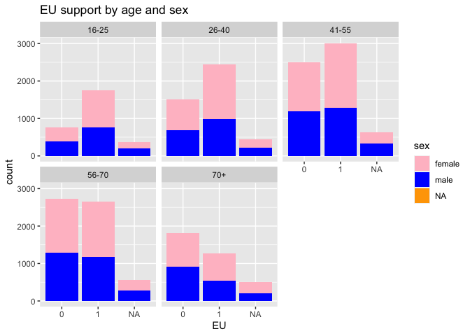

Formative data assignment 1 (SSI2006/3002, 2020-21)
================

**Part I.**

## Open data (10 points)

In this assignment you will work with the individual level data (the
indresp file) from wave 8 of the Understanding Society survey. First,
you need to open the data set. Please complete the code below.

``` r
library(tidyverse)
```

    ## ── Attaching packages ─────────────────────────────────────── tidyverse 1.3.1 ──

    ## ✓ ggplot2 3.3.5     ✓ purrr   0.3.4
    ## ✓ tibble  3.1.2     ✓ dplyr   1.0.7
    ## ✓ tidyr   1.1.4     ✓ stringr 1.4.0
    ## ✓ readr   2.1.1     ✓ forcats 0.5.1

    ## ── Conflicts ────────────────────────────────────────── tidyverse_conflicts() ──
    ## x dplyr::filter() masks stats::filter()
    ## x dplyr::lag()    masks stats::lag()

``` r
library(vroom)
h_indresp <- vroom('UKDA-6614-tab/tab/ukhls/h_indresp.tab')
```

    ## Rows: 39293 Columns: 2156

    ## ── Column specification ────────────────────────────────────────────────────────
    ## Delimiter: "\t"
    ## dbl (2156): pidp, pid, h_hidp, h_pno, h_childpno, h_hhorig, h_memorig, h_psu...

    ## 
    ## ℹ Use `spec()` to retrieve the full column specification for this data.
    ## ℹ Specify the column types or set `show_col_types = FALSE` to quiet this message.

Now you have got your data frame stored as Data.

## Select variables (10 points)

The data for Wave 8 of the Understanding Society were collected in
2016-18. Among other things, people were asked the following question:
“Should the United Kingdom remain a member of the European Union or
leave the European Union?” In this assignment, we will explore how
answers to this question depend on sex and age.

First, you need to select the variables for the analysis. You want to
keep the following variables: cross-wave individual identifier (*pidp*),
support for the UK remaining or leaving the EU (*h\_eumem*), sex
(*h\_sex\_dv*), age (*h\_age\_dv*), and sample origin (*h\_memorig*).

Complete the code below to select those variables from the data frame
and save the result.

``` r
w8 <- h_indresp %>%
        select(pidp, h_eumem,h_sex_dv,h_age_dv,h_memorig)
```

## Filter observations (10 points)

To make nationally representative estimates from the Understanding
Society data we would need to use weight coefficients. There are many
different types of weight coefficients that can be used depending on the
question and the level of analysis (see the User Guide, pp. 65-71). We
will not do this in this assignment. However, what we want to do is to
keep data from the original Understanding Society sample only (ukhls gb
2009-10), dropping data for Northern Ireland, the BHPS cohort members
and ethnic minority boost samples. This will make data closer to be
representative for Great Britain. You need to choose the observations
where *h\_memorig* has the value of 1.

``` r
w8 <- w8 %>%
  filter(h_memorig==1)
```

## Recode data (20 points)

Let us tabulate the variables for EU support, sex, and age.

``` r
table(w8$h_eumem)
```

    ## 
    ##    -9    -8    -7    -2    -1     1     2 
    ##    33   482   879   354   753 11118  9338

``` r
table(w8$h_sex_dv)
```

    ## 
    ##     0     1     2 
    ##     1 10470 12486

``` r
table(w8$h_age_dv)
```

    ## 
    ##  16  17  18  19  20  21  22  23  24  25  26  27  28  29  30  31  32  33  34  35 
    ## 284 309 290 291 278 295 268 326 287 257 243 235 228 249 274 278 278 293 314 332 
    ##  36  37  38  39  40  41  42  43  44  45  46  47  48  49  50  51  52  53  54  55 
    ## 351 332 321 336 320 327 368 404 372 386 435 465 425 447 406 420 427 414 432 422 
    ##  56  57  58  59  60  61  62  63  64  65  66  67  68  69  70  71  72  73  74  75 
    ## 408 413 416 434 369 398 358 399 354 412 345 357 413 434 431 334 326 293 275 251 
    ##  76  77  78  79  80  81  82  83  84  85  86  87  88  89  90  91  92  93  94  95 
    ## 219 231 211 205 181 162 138 117 117 108  89  78  77  48  41  27  15  18  15   7 
    ##  96  97  98  99 101 102 
    ##   6   2   3   1   1   1

You will see that all these variables are numeric. You can learn what
the numeric codes mean by checking the codebook here:
<https://www.understandingsociety.ac.uk/documentation/mainstage/dataset-documentation/datafile/indresp/wave/8>
.

We want to do the following:

1.  Recode the variable for EU support as binary (1 for Remain, 0 for
    Leave), coding all types of missing values (including refusals and
    “don’t know”) as NA.
2.  Recode sex into a character vector with the values “male” or
    “female”.
3.  Recode age into a variable with the following categories: 16 to 25,
    26 to 40, 41 to 55, 56 to 70, over 70.

In all cases, we want to create new variables.

``` r
w8 <- w8 %>%
  mutate(EU = ifelse(h_eumem==1,1,ifelse(h_eumem==2,0,"NA"))) %>%
  mutate(sex = ifelse(h_sex_dv==1,"male",ifelse(h_sex_dv==2,"female","NA"))) %>%
  mutate(agegr = case_when(
    h_age_dv %in% 16:25 ~ "16-25",
    h_age_dv %in% 26:40 ~ "26-40",
    h_age_dv %in% 41:55 ~ "41-55",
    h_age_dv %in% 56:70 ~ "56-70",
    h_age_dv > 70 ~ "70+"))
      
#did count() for new variables
```

## Summarise data (20 points)

Let us **dplyr** to calculate how many people in the sample supported
Remain and Leave, both as absolute numbers and percentages.

``` r
support <- w8 %>%
  select(EU) %>%
  summarise(Absolutes = c(sum(EU==1),sum(EU==0),sum(EU=="NA")),
            Percentages =c(Absolutes[1]*100/length(EU),
                           Absolutes[2]*100/length(EU),
                           Absolutes[3]*100/length(EU))) 
#rownames depreciated with tibble
support <- as.data.frame(support)
rownames(support)=c("Remain","Leave","NA")
support
```

    ##        Absolutes Percentages
    ## Remain     11118    48.42967
    ## Leave       9338    40.67605
    ## NA          2501    10.89428

Write a couple of sentences with the interpretation of this result. How
this compares with the result of the 2016 referendum? Why?

The 2016 referendum resulted in a larger ‘Leave’ vote than ‘Remain’.
This survey seems to indicate that the result would be ‘Remain’. This
suggests that people may have not responded honestly to the survey
question. Could be due to them feeling the ‘correct’ answer is to vote
‘Remain’. This may be supported by the fact that in the survey 10% of
respondants either chose not to answer the question or ‘missed’ it out
-“NA”.

## Summarise data by sex and age (30 points)

Now let us look at the support for Leave and Remain by sex and age. Use
your newly created variables.

``` r
w8 %>%
  ggplot(mapping=aes(x=EU,fill=sex))+
  geom_histogram(stat = "count")+
  facet_wrap(~agegr)+
  scale_fill_manual(values=c("pink","blue","orange")) +
  ggtitle("EU support by age and sex")
```

    ## Warning: Ignoring unknown parameters: binwidth, bins, pad

<!-- -->

Write a couple of sentences interpreting your results.

Remain =1 Leave =0 Age: Above 55yrs, people overwhelming voted to Leave.
Below 55, “remain”. Sex: Fairly equal. Age seems more significant
predictor of vote. Non-response: Fairly equal across sex, slightly
larger as age increases

**Part II.**

## Read data

We will work with three different tables: household roster from wave 8
(*h\_egoalt*), stable characteristics of individuals (*xwavedat*), and
household data from wave 8 (*h\_hhresp*).

``` r
# You need to complete the paths to these files on your computer.
Egoalt8 <- read_tsv("UKDA-6614-tab/tab/ukhls/h_egoalt.tab")
```

    ## Rows: 132818 Columns: 21

    ## ── Column specification ────────────────────────────────────────────────────────
    ## Delimiter: "\t"
    ## dbl (21): pidp, h_hidp, h_pno, apidp, h_apno, h_hhorig, h_memorig, h_psu, h_...

    ## 
    ## ℹ Use `spec()` to retrieve the full column specification for this data.
    ## ℹ Specify the column types or set `show_col_types = FALSE` to quiet this message.

``` r
Stable <- read_tsv("UKDA-6614-tab/tab/ukhls/xwavedat.tab")
```

    ## Rows: 149405 Columns: 174

    ## ── Column specification ────────────────────────────────────────────────────────
    ## Delimiter: "\t"
    ## dbl (174): pidp, pid, xwdat_dv, hhorig, memorig, memorig_bh, quarter, psu, s...

    ## 
    ## ℹ Use `spec()` to retrieve the full column specification for this data.
    ## ℹ Specify the column types or set `show_col_types = FALSE` to quiet this message.

``` r
Hh8 <- read_tsv("UKDA-6614-tab/tab/ukhls/h_hhresp.tab")
```

    ## Rows: 21745 Columns: 528

    ## ── Column specification ────────────────────────────────────────────────────────
    ## Delimiter: "\t"
    ## dbl (528): h_hidp, h_intnum, h_hhorig, h_psu, h_strata, h_month, h_quarter, ...

    ## 
    ## ℹ Use `spec()` to retrieve the full column specification for this data.
    ## ℹ Specify the column types or set `show_col_types = FALSE` to quiet this message.

## Filter household roster data (10 points)

The **egoalt8** data table contains data on the kin and other
relationships between people in the same household. In each row in this
table you will have a pair of individuals in the same household: ego
(identified by *pidp*) and alter (identified by *apidp*).
*h\_relationship\_dv* shows the type of relationship between ego and
alter. You can check the codes in the Understanding Society codebooks
here –
<https://www.understandingsociety.ac.uk/documentation/mainstage/dataset-documentation>.

First we want to select only pairs of individuals who are husbands and
wives or cohabiting partners (codes 1 and 2). For convenience, we also
want to keep only the variables *pidp*, *apidp*, *h\_hidp* (household
identifier), *h\_relationship\_dv*, *h\_sex* (ego’s sex), and *h\_asex*
(alter’s sex).

``` r
Partners8 <- Egoalt8 %>%
        filter(h_relationship_dv==1|h_relationship_dv==2) %>%
        select(pidp, apidp, h_hidp, h_relationship_dv, h_sex, h_asex)
head(Partners8)
```

    ## # A tibble: 6 x 6
    ##      pidp     apidp    h_hidp h_relationship_dv h_sex h_asex
    ##     <dbl>     <dbl>     <dbl>             <dbl> <dbl>  <dbl>
    ## 1   76165 142378492 142235614                 1     2      1
    ## 2  280165 756200970 755643214                 1     2      1
    ## 3  956765 749747605 755160414                 1     1      2
    ## 4 2270525 824548414 824548294                 2     2      1
    ## 5 2332405   2333085 416058694                 1     1      2
    ## 6 2333085   2332405 416058694                 1     2      1

Each couple now appears in the data twice: 1) with one partner as ego
and the other as alter, 2) the other way round. Now we will only focus
on heterosexual couples, and keep one observation per couple with women
as egos and men as their alters.

``` r
Hetero8 <- Partners8 %>%
        # keep only one observation per couple with women as egos
        filter(h_sex==2) %>%
        # filter out same-sex couples
        filter(h_asex==1)
```

## Recode data on ethnicity (10 points)

In this assignment we will explore ethnic endogamy, i.e. marriages and
partnerships within the same ethnic group. First, let us a create a
version of the table with stable individual characteristics with two
variables only: *pidp* and *racel\_dv* (ethnicity).

``` r
Stable2 <- Stable %>%
        select(pidp, racel_dv)
```

Let’s code missing values on ethnicity (-9) as NA.

``` r
Stable2 <- Stable2 %>%
        mutate(racel_dv = recode(racel_dv, `-9` = NA_real_))
```

Now let us recode the variable on ethnicity into a new binary variable
with the following values: “White” (codes 1 to 4) and “non-White” (all
other codes).

``` r
Stable2 <- Stable2 %>%
        mutate(race = ifelse(racel_dv==1|racel_dv==2 |racel_dv==3|racel_dv==4,1,0)
        )
```

## Join data (30 points)

Now we want to join data from the household roster (*Hetero8*) and the
data table with ethnicity (*Stable2*). First let us merge in the data on
ego’s ethnicity. We want to keep all the observations we have in
*Hetero8*, but we don’t want to add any other individuals from
*Stable2*.

``` r
Hetero8 %>% summary()
```

    ##       pidp               apidp               h_hidp          h_relationship_dv
    ##  Min.   :7.616e+04   Min.   :9.568e+05   Min.   :6.801e+07   Min.   :1.000    
    ##  1st Qu.:4.082e+08   1st Qu.:4.082e+08   1st Qu.:4.087e+08   1st Qu.:1.000    
    ##  Median :7.486e+08   Median :7.487e+08   Median :7.508e+08   Median :1.000    
    ##  Mean   :7.843e+08   Mean   :7.844e+08   Mean   :7.848e+08   Mean   :1.184    
    ##  3rd Qu.:1.158e+09   3rd Qu.:1.158e+09   3rd Qu.:1.161e+09   3rd Qu.:1.000    
    ##  Max.   :1.653e+09   Max.   :1.653e+09   Max.   :1.639e+09   Max.   :2.000    
    ##      h_sex       h_asex 
    ##  Min.   :2   Min.   :1  
    ##  1st Qu.:2   1st Qu.:1  
    ##  Median :2   Median :1  
    ##  Mean   :2   Mean   :1  
    ##  3rd Qu.:2   3rd Qu.:1  
    ##  Max.   :2   Max.   :1

``` r
Stable2 %>% summary()
```

    ##       pidp              racel_dv          race      
    ##  Min.   :6.870e+02   Min.   : 1.00   Min.   :0.00   
    ##  1st Qu.:2.053e+08   1st Qu.: 1.00   1st Qu.:1.00   
    ##  Median :6.141e+08   Median : 1.00   Median :1.00   
    ##  Mean   :6.772e+08   Mean   : 3.49   Mean   :0.82   
    ##  3rd Qu.:1.090e+09   3rd Qu.: 1.00   3rd Qu.:1.00   
    ##  Max.   :1.653e+09   Max.   :97.00   Max.   :1.00   
    ##                      NA's   :48118   NA's   :48118

``` r
JoinedEthn <- Hetero8 %>%
  left_join(Stable2, by='pidp')
```

Let us rename the variables for ethnicity to clearly indicate that they
refer to egos.

``` r
JoinedEthn <- JoinedEthn %>%
        rename(egoRacel_dv = racel_dv) %>%
        rename(egoRace = race)
```

Now let us merge in the data on alter’s ethnicity. Note that in this
case the key variables have different names in two data tables; please
refer to the documentation for your join function (or the relevant
section from R for Data Science) to check the solution for this problem.

``` r
JoinedEthn <- Stable2 %>%
  rename(apidp = pidp) %>%
  rename(alterRace = race) %>%
  rename(alterRacel_dv = racel_dv) %>%
  select(apidp, alterRace, alterRacel_dv) %>%
  right_join(JoinedEthn, by='apidp')
```

Renaming the variables for alters.

``` r
#already done 
#JoinedEthn <- JoinedEthn %>%
        #rename(alterRacel_dv = racel_dv) %>%
        #rename(alterRace = race)
JoinedEthn %>%
  count(alterRace)
```

    ## # A tibble: 3 x 2
    ##   alterRace     n
    ##       <dbl> <int>
    ## 1         0  2163
    ## 2         1 10445
    ## 3        NA  1007

## Explore probabilities of racial endogamy (20 points)

Let us start by looking at the joint distribution of race (White
vs. non-White) of both partners.

``` r
TableRace <- JoinedEthn %>%
        # filter out observations with missing data
        filter(!is.na(alterRace))%>%
  filter(!is.na(alterRacel_dv)) %>%
  filter(!is.na(egoRace)) %>%
  filter(!is.na(egoRacel_dv)) 

TableRace %>%
  count(alterRace, egoRace)
```

    ## # A tibble: 4 x 3
    ##   alterRace egoRace     n
    ##       <dbl>   <dbl> <int>
    ## 1         0       0  1822
    ## 2         0       1   270
    ## 3         1       0   336
    ## 4         1       1  9793

Now calculate the following probabilities: 1) for a White woman to have
a White partner, 2) for a White woman to have a non-White partner, 3)
for a non-White woman to have a White partner, 4) for a non-White woman
to have a non-White partner.

Of course, you can simply calculate these numbers manually. However, the
code will not be reproducible: if the data change the code will need to
be changed, too. Your task is to write reproducible code producing a
table with the required four probabilities.

``` r
TableRace %>%
  group_by(egoRace, alterRace) %>%
  summarise(n = n()) %>%
  mutate(freq = n / sum(n))
```

    ## `summarise()` has grouped output by 'egoRace'. You can override using the `.groups` argument.

    ## # A tibble: 4 x 4
    ## # Groups:   egoRace [2]
    ##   egoRace alterRace     n   freq
    ##     <dbl>     <dbl> <int>  <dbl>
    ## 1       0         0  1822 0.844 
    ## 2       0         1   336 0.156 
    ## 3       1         0   270 0.0268
    ## 4       1         1  9793 0.973

## Join with household data and calculate mean and median number of children by ethnic group (30 points)

1.  Join the individual-level file with the household-level data from
    wave 8 (specifically, we want the variable for the number of
    children in the household).
2.  Select only couples that are ethnically endogamous (i.e. partners
    come from the same ethnic group) for the following groups: White
    British, Indian, and Pakistani.
3.  Produce a table showing the mean and median number of children in
    these households by ethnic group (make sure the table has meaningful
    labels for ethnic groups, not just numerical codes).
4.  Write a short interpretation of your results. What could affect your
    findings?

**Part III.**

## Read data

First we want to read and join the data for the first 7 waves of the
Understanding Society. (Wave 8 does not have a variable for political
interest). We only want five variables: personal identifier, sample
origin, sex, age and political interest. It is tedious to join all the
seven waves manually, and it makes sense to use a loop in this case.
Since you don’t yet know about iteration I’ll provide the code for you;
please also see a video on ELE.

The only thing you need to do for this code to work on your computer is
to provide a path to the directory where the data are stored on your
computer.

## Reshape data (20 points)

Now we have got the data from all 7 waves in the same data frame
**all7** in the wide format. Note that the panel is unbalanced, i.e. we
included all people who participated in at least one wave of the survey.
Reshape the data to the long format. The resulting data frame should
have six columns for six variables.

## Filter and recode (20 points)

Now we want to filter the data keeping only respondents from the
original UKHLS sample for Great Britain (memorig == 1). We also want to
clean the variables for sex (recoding it to “male” or “female”) and
political interest (keeping the values from 1 to 4 and coding all
negative values as missing). Tabulate *sex* and *vote6* to make sure
your recodings were correct.

## Calculate mean political interest by sex and wave (10 points)

Political interest is an ordinal variable, but we will treat it as
interval and calculate mean political interest for men and women in each
wave.

## Reshape the data frame with summary statistics (20 points)

Your resulting data frame with the means is in the long format. Reshape
it to the wide format. It should look like this:

| sex\_dv | a   | b   | c   | d   | e   | f   | g   |
|---------|-----|-----|-----|-----|-----|-----|-----|
| female  |     |     |     |     |     |     |     |
| male    |     |     |     |     |     |     |     |

In the cells of this table you should have mean political interest by
sex and wave.

Write a short interpretation of your findings.

## Estimate stability of political interest (30 points)

Political scientists have been arguing how stable the level of political
interest is over the life course. Imagine someone who is not interested
in politics at all so that their value of *vote6* is always 4. Their
level of political interest is very stable over time, as stable as the
level of political interest of someone who is always very interested in
politics (*vote6* = 1). On the other hand, imagine someone who changes
their value of *votes6* from 1 to 4 and back every other wave. Their
level of political interest is very unstable.

Let us introduce a measure of stability of political interest that is
going to be equal to the sum of the absolute values of changes in
political interest from wave to wave. Let us call this measure Delta. It
is difficult for me to typeset a mathematical formula in Markdown, but
I’ll explain this informally.

Imagine a person with the level of political interest that is constant
over time: {1, 1, 1, 1, 1, 1, 1}. For this person, Delta is zero.

Now imagine a person who changes once from “very interested in politics”
to “fairly interested in politics”: {1, 1, 1, 1, 2, 2, 2}. For them,
Delta = (1 - 1) + (1 - 1) + (1 - 1) + (2 - 1) + (2 - 2) + (2 - 2) = 1.

Now imagine someone who changes from “very interested in politics” to
“not at all interested” every other wave: {1, 4, 1, 4, 1, 4, 1}. Delta =
(4 - 1) + abs(1 - 4) + (4 - 1) + abs(1 - 4) + (4 - 1) + abs(1 - 4) = 3
\* 6 = 18.

Large Delta indicates unstable political interest. Delta = 0 indicates a
constant level of political interest.

Write the R code that does the following.

1.  To simplify interpretation, keep only the respondents with
    non-missing values for political interest in all seven waves.
2.  Calculate Delta for each person in the data set.
3.  Calculate mean Delta for men and women.
4.  Calculate mean Delta by age (at wave 1) and plot the local
    polynomial curve showing the association between age at wave 1 and
    mean Delta. You can use either **ggplot2** or the *scatter.smooth()*
    function from base R.
5.  Write a short interpretation of your findings.
