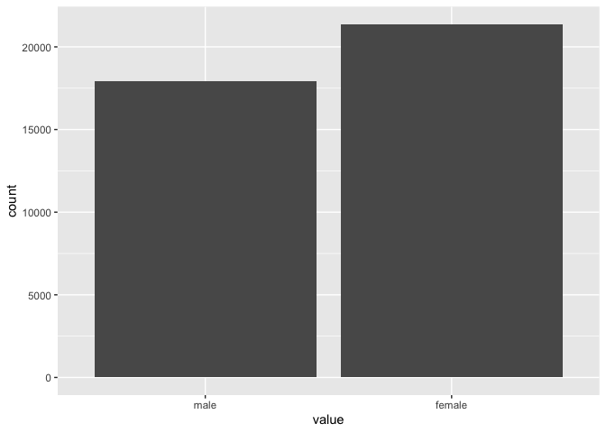
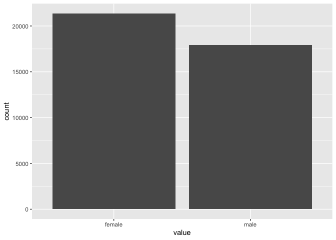
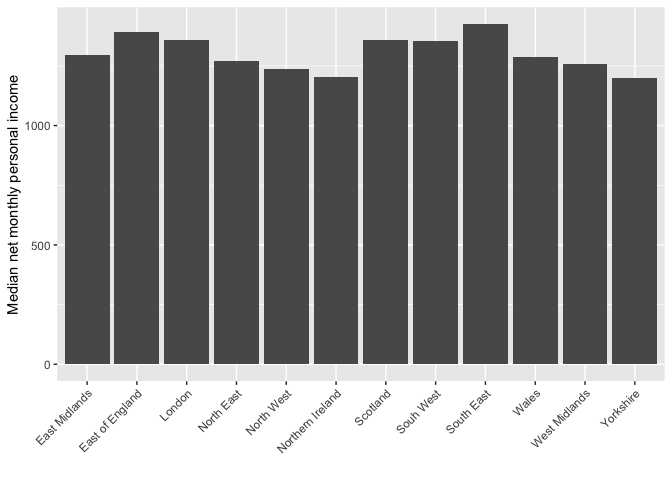
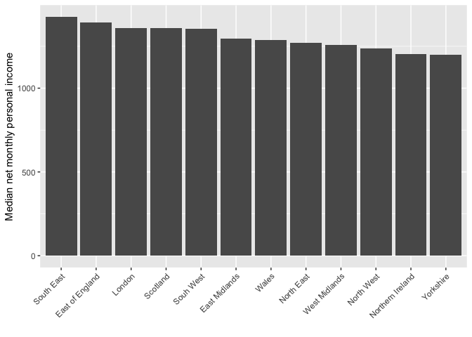

Data Analysis 3: Week 11 (1)
================
Alexey Bessudnov
25 March 2020

Plan for this session:

1.  Vectors and other data types.
2.  Factors.

<!-- end list -->

  - Types of variables in social science research.

  - R data structures.

  - Vectors.

Numeric (integer and double). Vectorisation.

``` r
x <- 1:6
typeof(x)
```

    ## [1] "integer"

``` r
length(x)
```

    ## [1] 6

``` r
y <- c(1.2, 1.5, 2.76)
typeof(y)
```

    ## [1] "double"

``` r
length(y)
```

    ## [1] 3

``` r
x*2
```

    ## [1]  2  4  6  8 10 12

``` r
x + y
```

    ## [1] 2.20 3.50 5.76 5.20 6.50 8.76

Exercise 1. Create a vector of length 100, randomly drawing it from the
standard normal distribution. Find the mean and standard deviation.
Multiply the vector by 2. Are the mean and standard deviation going to
change?

``` r
x <- rnorm(100)
head(x)
```

    ## [1]  2.1183974  1.5288465 -0.3430941 -0.9345490  3.1625848  0.5699517

``` r
mean(x)
```

    ## [1] 0.02404573

``` r
mean(x*2)
```

    ## [1] 0.04809145

``` r
sd(x)
```

    ## [1] 1.030694

``` r
sd(x*2)
```

    ## [1] 2.061387

Exercise 2. Read the individual wave 8 UndSoc data and extract the
variable for age from the data frame. What type is it?

``` r
library(tidyverse)
df <- read_tsv("data/UKDA-6614-tab/tab/ukhls_w8/h_indresp.tab")
df %>% pull(h_age_dv) %>% typeof()
```

    ## [1] "double"

``` r
df %>% pull(h_age_dv) %>% table()
```

    ## .
    ##  16  17  18  19  20  21  22  23  24  25  26  27  28  29  30  31  32  33  34  35 
    ## 554 625 584 566 536 542 556 559 552 494 461 475 460 484 500 499 551 542 557 592 
    ##  36  37  38  39  40  41  42  43  44  45  46  47  48  49  50  51  52  53  54  55 
    ## 685 654 622 645 605 618 674 677 675 701 770 753 753 758 728 745 706 674 711 704 
    ##  56  57  58  59  60  61  62  63  64  65  66  67  68  69  70  71  72  73  74  75 
    ## 685 675 650 654 590 616 569 634 538 605 516 571 604 643 621 517 487 434 426 403 
    ##  76  77  78  79  80  81  82  83  84  85  86  87  88  89  90  91  92  93  94  95 
    ## 361 350 316 314 275 255 213 195 177 176 136 121 117  72  63  43  27  30  21  16 
    ##  96  97  98  99 100 101 102 
    ##  10   5   5   2   3   3   2

``` r
age <- df %>% pull(h_age_dv)
typeof(age)
```

    ## [1] "double"

``` r
age <- as.integer(age)
typeof(age)
```

    ## [1] "integer"

Logical vectors.

Exercise 3. Convert sex into a logical vector for being male. Calculate
the proportion of men in the data set.

``` r
sex <- df %>% pull(h_sex_dv)
male <- ifelse(sex == 1, TRUE, FALSE)
head(male)
```

    ## [1] FALSE FALSE FALSE  TRUE FALSE FALSE

``` r
typeof(male)
```

    ## [1] "logical"

``` r
TRUE == 1
```

    ## [1] TRUE

``` r
FALSE == 0
```

    ## [1] TRUE

``` r
mean(male)
```

    ## [1] 0.4561118

Character vectors.

Exercise 4. Convert sex into a character vector with the values “male”
and “female”.

``` r
sex_chr <- ifelse(sex == 1, "male",
                  ifelse(sex == 2, "female", NA))
typeof(sex_chr)
```

    ## [1] "character"

``` r
x <- 1:6
x
```

    ## [1] 1 2 3 4 5 6

``` r
x <- as.character(x)
x
```

    ## [1] "1" "2" "3" "4" "5" "6"

``` r
mean(x)
```

    ## [1] NA

``` r
x <- as.numeric(x)
x
```

    ## [1] 1 2 3 4 5 6

``` r
y <- c("1", "a", "2")
as.numeric(y)
```

    ## [1]  1 NA  2

Factors (augmented numeric).

Exercise 5. Convert sex into a factor. Change the order of levels.

``` r
library(forcats)
sex_fct <- factor(sex_chr)
typeof(sex_fct)
```

    ## [1] "integer"

``` r
class(sex_fct)
```

    ## [1] "factor"

``` r
str(sex_fct)
```

    ##  Factor w/ 2 levels "female","male": 1 1 1 2 1 1 2 2 1 2 ...

``` r
levels(sex_fct)
```

    ## [1] "female" "male"

``` r
sex_fct2 <- factor(sex_chr, levels = c("male", "female"))
levels(sex_fct2)
```

    ## [1] "male"   "female"

``` r
sex_fct3 <- fct_relevel(sex_chr, "male")
levels(sex_fct3)
```

    ## [1] "male"   "female"

``` r
sex_fct3 %>%
  as_tibble() %>%
  filter(!is.na(sex_fct3)) %>%
  ggplot(aes(x = value)) +
  geom_bar()
```

<!-- -->

``` r
sex_fct %>%
  as_tibble() %>%
  filter(!is.na(sex_fct3)) %>%
  ggplot(aes(x = value)) +
  geom_bar()
```

<!-- -->

Re-ordering factors is useful for producing graphs.

``` r
byRegion <- df %>%
  mutate(region = recode(h_gor_dv,
                         `-9` = NA_character_,
                         `1` = "North East",
                         `2` = "North West",
                         `3` = "Yorkshire",
                         `4` = "East Midlands",
                         `5` = "West Midlands",
                         `6` = "East of England",
                         `7` = "London",
                         `8` = "South East",
                         `9` = "Souh West",
                         `10` = "Wales",
                         `11` = "Scotland",
                         `12` = "Northern Ireland")) %>%
  filter(!is.na(region)) %>%
  group_by(region) %>%
  summarise(
    medianIncome = median(h_fimnnet_dv, na.rm = TRUE)
  )


# not ordered
byRegion %>%
  ggplot(
    aes(x = region, y = medianIncome)
    ) +
    geom_bar(stat = "identity") +
    xlab("") +
    ylab("Median net monthly personal income") +
    theme(axis.text.x = element_text(angle = 45, hjust = 1))
```

<!-- -->

``` r
# ordered (1)

byRegion %>%
ggplot(
  aes(x = reorder(region, medianIncome), y = medianIncome)
  ) +
  geom_bar(stat = "identity") +
  xlab("") +
  ylab("Median net monthly personal income") +
  theme(axis.text.x = element_text(angle = 45, hjust = 1))
```

<!-- -->

``` r
# ordered (2)

byRegion %>%
ggplot(
  aes(x = fct_reorder(region, medianIncome), y = medianIncome)
  ) +
  geom_bar(stat = "identity") +
  xlab("") +
  ylab("Median net monthly personal income") +
  theme(axis.text.x = element_text(angle = 45, hjust = 1))
```

<!-- -->

``` r
# in the decreasing order

byRegion %>%
ggplot(
  aes(x = fct_reorder(region, -medianIncome), y = medianIncome)
  ) +
  geom_bar(stat = "identity") +
  xlab("") +
  ylab("Median net monthly personal income") +
  theme(axis.text.x = element_text(angle = 45, hjust = 1))
```

<!-- -->

Recoding factors.

``` r
# We've already recoded region in the example above.

df %>%
  mutate(region = recode(h_gor_dv,
                         `-9` = NA_character_,
                         `1` = "North East",
                         `2` = "North West",
                         `3` = "Yorkshire",
                         `4` = "East Midlands",
                         `5` = "West Midlands",
                         `6` = "East of England",
                         `7` = "London",
                         `8` = "South East",
                         `9` = "Souh West",
                         `10` = "Wales",
                         `11` = "Scotland",
                         `12` = "Northern Ireland")) %>%
  count(region)
```

    ## # A tibble: 13 x 2
    ##    region               n
    ##    <chr>            <int>
    ##  1 East Midlands     2717
    ##  2 East of England   3192
    ##  3 London            5414
    ##  4 North East        1355
    ##  5 North West        3963
    ##  6 Northern Ireland  2550
    ##  7 Scotland          3198
    ##  8 Souh West         3015
    ##  9 South East        4536
    ## 10 Wales             2522
    ## 11 West Midlands     3355
    ## 12 Yorkshire         3461
    ## 13 <NA>                15

``` r
# Note that the levels have been arranged alphabetically.

# Another way to recode from forcats.

df %>%
  mutate(h_gor_dv = factor(h_gor_dv)) %>%
  mutate(region = fct_recode(h_gor_dv,
                         NULL = "-9",
                         "North East" = "1",
                         "North West" = "2",
                         "Yorkshire" = "3",
                         "East Midlands" = "4",
                         "West Midlands" = "5",
                         "East of England" = "6",
                         "London" = "7",
                         "South East" = "8",
                         "Souh West" = "9",
                         "Wales" = "10",
                         "Scotland" = "11",
                         "Northern Ireland" = "12")) %>%
  count(region)
```

    ## # A tibble: 13 x 2
    ##    region               n
    ##    <fct>            <int>
    ##  1 North East        1355
    ##  2 North West        3963
    ##  3 Yorkshire         3461
    ##  4 East Midlands     2717
    ##  5 West Midlands     3355
    ##  6 East of England   3192
    ##  7 London            5414
    ##  8 South East        4536
    ##  9 Souh West         3015
    ## 10 Wales             2522
    ## 11 Scotland          3198
    ## 12 Northern Ireland  2550
    ## 13 <NA>                15

``` r
# Note the warning message and the order of the levels.

# Sometimes you may want to combine the levels

df %>%
  mutate(h_gor_dv = factor(h_gor_dv)) %>%
  mutate(region = fct_collapse(h_gor_dv,
                         NULL = "-9",
                         England = c("1", "2", "3", "4", "5", "6", "7", "8", "9"),
                         Wales = c("10"),
                         Scotland = c("11"),
                         "Northern Ireland" = c("12"))) %>%
  count(region)
```

    ## # A tibble: 5 x 2
    ##   region               n
    ##   <fct>            <int>
    ## 1 England          31008
    ## 2 Wales             2522
    ## 3 Scotland          3198
    ## 4 Northern Ireland  2550
    ## 5 <NA>                15

Matrices and data frames.

``` r
x <- matrix(1:10, nrow = 2)
x
```

    ##      [,1] [,2] [,3] [,4] [,5]
    ## [1,]    1    3    5    7    9
    ## [2,]    2    4    6    8   10

``` r
y <- data.frame(x = c(TRUE, FALSE, TRUE), y = 1:3, z = letters[1:3])
y
```

    ##       x y z
    ## 1  TRUE 1 a
    ## 2 FALSE 2 b
    ## 3  TRUE 3 c

Lists.

Exercise 6. Make a list of four elements containing: 1) the vector from
exercise 1, 2) the vector from exercise 3, 3) TRUE, 4) a list with your
name and your surname.

``` r
l1 <- list(x, sex_chr, TRUE, list("Alexey", "Bessudnov"))
str(l1)
```

    ## List of 4
    ##  $ : int [1:2, 1:5] 1 2 3 4 5 6 7 8 9 10
    ##  $ : chr [1:39293] "female" "female" "female" "male" ...
    ##  $ : logi TRUE
    ##  $ :List of 2
    ##   ..$ : chr "Alexey"
    ##   ..$ : chr "Bessudnov"

``` r
a <- l1[2]
typeof(a)
```

    ## [1] "list"

``` r
b <- l1[[2]]
typeof(b)
```

    ## [1] "character"

``` r
l1[[4]][[2]]
```

    ## [1] "Bessudnov"

Exercise 7. Regress earnings on age and age squared. Extract regression
coefficients as a vector.

``` r
m1 <- lm(h_fimnnet_dv ~ h_age_dv + I(h_age_dv^2), df)
m1
```

    ## 
    ## Call:
    ## lm(formula = h_fimnnet_dv ~ h_age_dv + I(h_age_dv^2), data = df)
    ## 
    ## Coefficients:
    ##   (Intercept)       h_age_dv  I(h_age_dv^2)  
    ##     -818.3749        99.7129        -0.9169

``` r
summary(m1)
```

    ## 
    ## Call:
    ## lm(formula = h_fimnnet_dv ~ h_age_dv + I(h_age_dv^2), data = df)
    ## 
    ## Residuals:
    ##    Min     1Q Median     3Q    Max 
    ## -55844   -726   -222    411  87657 
    ## 
    ## Coefficients:
    ##                 Estimate Std. Error t value Pr(>|t|)    
    ## (Intercept)   -818.37490   54.04023  -15.14   <2e-16 ***
    ## h_age_dv        99.71285    2.32820   42.83   <2e-16 ***
    ## I(h_age_dv^2)   -0.91692    0.02302  -39.83   <2e-16 ***
    ## ---
    ## Signif. codes:  0 '***' 0.001 '**' 0.01 '*' 0.05 '.' 0.1 ' ' 1
    ## 
    ## Residual standard error: 1693 on 39290 degrees of freedom
    ## Multiple R-squared:  0.04746,    Adjusted R-squared:  0.04741 
    ## F-statistic: 978.8 on 2 and 39290 DF,  p-value: < 2.2e-16

``` r
typeof(m1)
```

    ## [1] "list"

``` r
str(m1)
```

    ## List of 12
    ##  $ coefficients : Named num [1:3] -818.375 99.713 -0.917
    ##   ..- attr(*, "names")= chr [1:3] "(Intercept)" "h_age_dv" "I(h_age_dv^2)"
    ##  $ residuals    : Named num [1:39293] 698 1136 735 264 737 ...
    ##   ..- attr(*, "names")= chr [1:39293] "1" "2" "3" "4" ...
    ##  $ effects      : Named num [1:39293] -305668 32625 -67412 255 728 ...
    ##   ..- attr(*, "names")= chr [1:39293] "(Intercept)" "h_age_dv" "I(h_age_dv^2)" "" ...
    ##  $ rank         : int 3
    ##  $ fitted.values: Named num [1:39293] 1392 1676 1474 1729 1616 ...
    ##   ..- attr(*, "names")= chr [1:39293] "1" "2" "3" "4" ...
    ##  $ assign       : int [1:3] 0 1 2
    ##  $ qr           :List of 5
    ##   ..$ qr   : num [1:39293, 1:3] -1.98e+02 5.04e-03 5.04e-03 5.04e-03 5.04e-03 ...
    ##   .. ..- attr(*, "dimnames")=List of 2
    ##   .. .. ..$ : chr [1:39293] "1" "2" "3" "4" ...
    ##   .. .. ..$ : chr [1:3] "(Intercept)" "h_age_dv" "I(h_age_dv^2)"
    ##   .. ..- attr(*, "assign")= int [1:3] 0 1 2
    ##   ..$ qraux: num [1:3] 1.01 1 1
    ##   ..$ pivot: int [1:3] 1 2 3
    ##   ..$ tol  : num 1e-07
    ##   ..$ rank : int 3
    ##   ..- attr(*, "class")= chr "qr"
    ##  $ df.residual  : int 39290
    ##  $ xlevels      : Named list()
    ##  $ call         : language lm(formula = h_fimnnet_dv ~ h_age_dv + I(h_age_dv^2), data = df)
    ##  $ terms        :Classes 'terms', 'formula'  language h_fimnnet_dv ~ h_age_dv + I(h_age_dv^2)
    ##   .. ..- attr(*, "variables")= language list(h_fimnnet_dv, h_age_dv, I(h_age_dv^2))
    ##   .. ..- attr(*, "factors")= int [1:3, 1:2] 0 1 0 0 0 1
    ##   .. .. ..- attr(*, "dimnames")=List of 2
    ##   .. .. .. ..$ : chr [1:3] "h_fimnnet_dv" "h_age_dv" "I(h_age_dv^2)"
    ##   .. .. .. ..$ : chr [1:2] "h_age_dv" "I(h_age_dv^2)"
    ##   .. ..- attr(*, "term.labels")= chr [1:2] "h_age_dv" "I(h_age_dv^2)"
    ##   .. ..- attr(*, "order")= int [1:2] 1 1
    ##   .. ..- attr(*, "intercept")= int 1
    ##   .. ..- attr(*, "response")= int 1
    ##   .. ..- attr(*, ".Environment")=<environment: R_GlobalEnv> 
    ##   .. ..- attr(*, "predvars")= language list(h_fimnnet_dv, h_age_dv, I(h_age_dv^2))
    ##   .. ..- attr(*, "dataClasses")= Named chr [1:3] "numeric" "numeric" "numeric"
    ##   .. .. ..- attr(*, "names")= chr [1:3] "h_fimnnet_dv" "h_age_dv" "I(h_age_dv^2)"
    ##  $ model        :'data.frame':   39293 obs. of  3 variables:
    ##   ..$ h_fimnnet_dv : num [1:39293] 2090 2812 2208 1992 2353 ...
    ##   ..$ h_age_dv     : num [1:39293] 31 39 33 41 37 26 34 46 50 43 ...
    ##   ..$ I(h_age_dv^2): 'AsIs' num [1:39293]  961 1521 1089 1681 1369 ...
    ##   ..- attr(*, "terms")=Classes 'terms', 'formula'  language h_fimnnet_dv ~ h_age_dv + I(h_age_dv^2)
    ##   .. .. ..- attr(*, "variables")= language list(h_fimnnet_dv, h_age_dv, I(h_age_dv^2))
    ##   .. .. ..- attr(*, "factors")= int [1:3, 1:2] 0 1 0 0 0 1
    ##   .. .. .. ..- attr(*, "dimnames")=List of 2
    ##   .. .. .. .. ..$ : chr [1:3] "h_fimnnet_dv" "h_age_dv" "I(h_age_dv^2)"
    ##   .. .. .. .. ..$ : chr [1:2] "h_age_dv" "I(h_age_dv^2)"
    ##   .. .. ..- attr(*, "term.labels")= chr [1:2] "h_age_dv" "I(h_age_dv^2)"
    ##   .. .. ..- attr(*, "order")= int [1:2] 1 1
    ##   .. .. ..- attr(*, "intercept")= int 1
    ##   .. .. ..- attr(*, "response")= int 1
    ##   .. .. ..- attr(*, ".Environment")=<environment: R_GlobalEnv> 
    ##   .. .. ..- attr(*, "predvars")= language list(h_fimnnet_dv, h_age_dv, I(h_age_dv^2))
    ##   .. .. ..- attr(*, "dataClasses")= Named chr [1:3] "numeric" "numeric" "numeric"
    ##   .. .. .. ..- attr(*, "names")= chr [1:3] "h_fimnnet_dv" "h_age_dv" "I(h_age_dv^2)"
    ##  - attr(*, "class")= chr "lm"

``` r
m1$coefficients
```

    ##   (Intercept)      h_age_dv I(h_age_dv^2) 
    ##  -818.3748954    99.7128513    -0.9169186

``` r
m1[[1]]
```

    ##   (Intercept)      h_age_dv I(h_age_dv^2) 
    ##  -818.3748954    99.7128513    -0.9169186

``` r
typeof(m1$coefficients)
```

    ## [1] "double"
