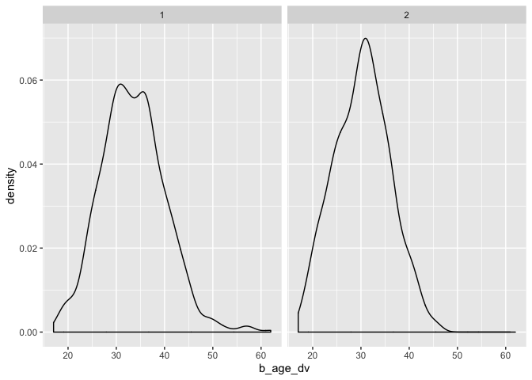
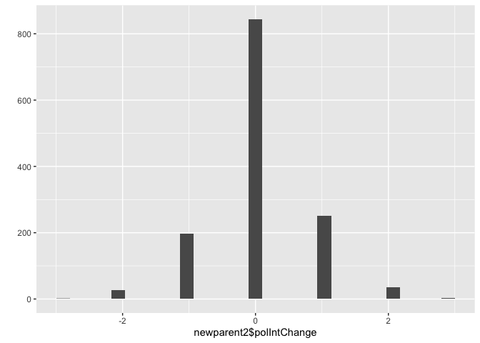

Data Analysis 3: Week 11
================
Alexey Bessudnov
27 March 2020

**Longitudinal data: political interest**

Example from class 5.

``` r
library(tidyverse)
# Read data and select variables
Ind1 <- read_tsv("data/UKDA-6614-tab/tab/ukhls_w1/a_indresp.tab")
Ind1 <- Ind1 %>%
  select(pidp, a_sex_dv, a_age_dv, a_vote6)
Ind2 <- read_tsv("data/UKDA-6614-tab/tab/ukhls_w2/b_indresp.tab")
Ind2 <- Ind2 %>%
  select(pidp, b_sex_dv, b_age_dv, b_vote6)
Ind3 <- read_tsv("data/UKDA-6614-tab/tab/ukhls_w3/c_indresp.tab")
Ind3 <- Ind3 %>%
  select(pidp, c_sex_dv, c_age_dv, c_vote6)
Wide <- Ind1 %>%
  full_join(Ind2, by = "pidp") %>%
  full_join(Ind3, by = "pidp")
Wide
```

    ## # A tibble: 70,586 x 10
    ##      pidp a_sex_dv a_age_dv a_vote6 b_sex_dv b_age_dv b_vote6 c_sex_dv c_age_dv
    ##     <dbl>    <dbl>    <dbl>   <dbl>    <dbl>    <dbl>   <dbl>    <dbl>    <dbl>
    ##  1 6.80e7        1       39       3       NA       NA      NA       NA       NA
    ##  2 6.80e7        1       59       2        1       60       2        1       61
    ##  3 6.80e7        2       39       4        2       40       4        2       41
    ##  4 6.80e7        2       17       4       NA       NA      NA        2       19
    ##  5 6.80e7        2       72       4        2       73       4        2       74
    ##  6 6.80e7        2       57       1        2       58       2        2       59
    ##  7 6.80e7        1       59      -7       NA       NA      NA       NA       NA
    ##  8 6.80e7        1       25      -7       NA       NA      NA       NA       NA
    ##  9 6.80e7        1       22      -7       NA       NA      NA       NA       NA
    ## 10 6.80e7        2       38       3        2       39       4       NA       NA
    ## # … with 70,576 more rows, and 1 more variable: c_vote6 <dbl>

``` r
# convert to long
Long <- Wide %>%
  gather(a_sex_dv:c_vote6, key = "variable", value = "value") %>%
  separate(variable, into = c("wave", "variable"), sep = "_", extra = "merge") %>%
  spread(key = variable, value = value)
Long
```

    ## # A tibble: 211,758 x 5
    ##      pidp wave  age_dv sex_dv vote6
    ##     <dbl> <chr>  <dbl>  <dbl> <dbl>
    ##  1 280165 a         NA     NA    NA
    ##  2 280165 b         31      2     2
    ##  3 280165 c         32      2    -7
    ##  4 541285 a         NA     NA    NA
    ##  5 541285 b         NA     NA    NA
    ##  6 541285 c         25      1    -7
    ##  7 541965 a         NA     NA    NA
    ##  8 541965 b         NA     NA    NA
    ##  9 541965 c         23      2    -7
    ## 10 665045 a         NA     NA    NA
    ## # … with 211,748 more rows

``` r
Long %>%
  count(vote6)
```

    ## # A tibble: 9 x 2
    ##   vote6     n
    ##   <dbl> <int>
    ## 1    -9   263
    ## 2    -7 10973
    ## 3    -2   130
    ## 4    -1   134
    ## 5     1 14178
    ## 6     2 48427
    ## 7     3 41235
    ## 8     4 39915
    ## 9    NA 56503

You may want to use some inequality/heterogeneity measure to explore the
stability of political interest at individual level (variance? Theil’s
enthropy?). You may also want to visualise changes in political
interest.

If you treat political interest as categorical it is possible to use
sequence anaysis: <http://traminer.unige.ch> (this would be a complex
analysis and you do not have to do this).

To determine how political interest changes depending on the electoral
cycle you’d need to identify the interview dates.

``` r
Ind1 <- read_tsv("data/UKDA-6614-tab/tab/ukhls_w1/a_indresp.tab")

Ind1 %>%
  select(pidp, a_intdatd_dv, a_intdatm_dv, a_intdaty_dv) %>%
  print(n = 10)
```

    ## # A tibble: 50,994 x 4
    ##        pidp a_intdatd_dv a_intdatm_dv a_intdaty_dv
    ##       <dbl>        <dbl>        <dbl>        <dbl>
    ##  1 68001367           19            1         2009
    ##  2 68004087            8            1         2009
    ##  3 68006127            9            1         2009
    ##  4 68006135            9            1         2009
    ##  5 68006807           16            1         2009
    ##  6 68007487           22            1         2009
    ##  7 68007491           22            1         2009
    ##  8 68007495           22            1         2009
    ##  9 68007499           22            1         2009
    ## 10 68008167           23            1         2009
    ## # … with 5.098e+04 more rows

Note that the timing of different waves can overlap.

**Childbirth and satisfaction**

The key thing here is to identify new childbirths. Note the *newborn*
data sets:
<https://www.understandingsociety.ac.uk/documentation/mainstage/dataset-documentation/search/datafile/newborn>.
You want to create a data frame that includes only new mothers and
fathers.

``` r
newborn2 <- read_tsv("data/UKDA-6614-tab/tab/ukhls_w2/b_newborn.tab")
```

At this stage you may want to filter out those who don’t live with their
children or whose children died.

``` r
# identify new parents in wave 2
newparent2 <- Ind2 %>%
        semi_join(newborn2, by = "pidp")
newparent2 %>%
  ggplot(aes(x = b_age_dv)) +
        geom_density() +
        facet_wrap(~ b_sex_dv)
```

<!-- -->

We can also look at how political interest changes in the wave following
the childbirth.

``` r
newparent2 <- newparent2 %>%
        left_join(Ind3, by = "pidp") %>%
        filter(c_vote6 > 0 & b_vote6 > 0) %>%
        mutate(polIntChange = c_vote6 - b_vote6)
qplot(newparent2$polIntChange)
```

<!-- -->

``` r
newparent2 %>%
        group_by(b_sex_dv) %>%
        summarise(
                meanChange = mean(polIntChange, na.rm = TRUE)
        )
```

    ## # A tibble: 2 x 2
    ##   b_sex_dv meanChange
    ##      <dbl>      <dbl>
    ## 1        1     0.0515
    ## 2        2     0.0690

Things will become more complex when you’ve got the data from all waves.

**Combination of individual- and household-level data: household
composition by ethnic group.**

``` r
Egoalt1 <- read_tsv("data/UKDA-6614-tab/tab/ukhls_w1/a_egoalt.tab")
```

Let us look at the household with a\_hidp 68006123.

``` r
oneHH <- Egoalt1 %>%
        filter(a_hidp == 68006123) %>%
        select(a_hidp, pidp, apidp, a_relationship_dv, a_sex, a_asex)
oneHH
```

    ## # A tibble: 12 x 6
    ##      a_hidp     pidp    apidp a_relationship_dv a_sex a_asex
    ##       <dbl>    <dbl>    <dbl>             <dbl> <dbl>  <dbl>
    ##  1 68006123 68006127 68006131                 2     2      1
    ##  2 68006123 68006127 68006135                 9     2      2
    ##  3 68006123 68006127 68006139                 9     2      2
    ##  4 68006123 68006131 68006127                 2     1      2
    ##  5 68006123 68006131 68006135                12     1      2
    ##  6 68006123 68006131 68006139                12     1      2
    ##  7 68006123 68006135 68006127                 4     2      2
    ##  8 68006123 68006135 68006131                 7     2      1
    ##  9 68006123 68006135 68006139                14     2      2
    ## 10 68006123 68006139 68006127                 4     2      2
    ## 11 68006123 68006139 68006131                 7     2      1
    ## 12 68006123 68006139 68006135                14     2      2

This is a household with four people: a couple with two children (so the
relationships are 2 (partner/cohabitee), 9 (parent), 12 (step-parent), 4
(natural son/daughter), 7 (stepson/stepdaughter), 14 (natural
brother/sister). More specifically, it’s a woman with two daughters and
their step-father, the woman’s partner (they are not married).

The key thing here is to write a code that identifies a household type
from this information. Then you can look at the distribution of the
types by ethnic group. Note that ethnic group is an individual, not
household characteristics, so you will need to develop some rules on how
you deal with ethnically mixed households.

As an example, let us calculate the number of people in the household by
ethnic group.

``` r
Ind1new <- read_tsv("data/UKDA-6614-tab/tab/ukhls_w1/a_indresp.tab")
Ind1new <- Ind1new %>%
  select(pidp, a_hidp, a_sex_dv, a_age_dv, a_racel_dv)
Ind1new %>%
        group_by(a_hidp) %>%
        mutate(nhh = n()) %>%
        group_by(a_racel_dv) %>%
        summarise(hhsize = mean(nhh, na.rm = TRUE))
```

    ## # A tibble: 19 x 2
    ##    a_racel_dv hhsize
    ##         <dbl>  <dbl>
    ##  1         -9   2.72
    ##  2          1   1.99
    ##  3          2   1.89
    ##  4          3   1.56
    ##  5          4   1.97
    ##  6          5   1.96
    ##  7          6   2.08
    ##  8          7   2.18
    ##  9          8   2.16
    ## 10          9   2.55
    ## 11         10   2.73
    ## 12         11   2.87
    ## 13         12   2.06
    ## 14         13   2.20
    ## 15         14   1.77
    ## 16         15   2.04
    ## 17         16   1.99
    ## 18         17   2.19
    ## 19         97   2.01

This is actually not quite correct (since ethnicity is an
individual-level variable) and you will be able to do better than this.

Let us get some more details on household 68006123.

``` r
oneHH %>%
        left_join(Ind1new, by = c("a_hidp", "pidp"))
```

    ## # A tibble: 12 x 9
    ##    a_hidp   pidp  apidp a_relationship_… a_sex a_asex a_sex_dv a_age_dv
    ##     <dbl>  <dbl>  <dbl>            <dbl> <dbl>  <dbl>    <dbl>    <dbl>
    ##  1 6.80e7 6.80e7 6.80e7                2     2      1        2       39
    ##  2 6.80e7 6.80e7 6.80e7                9     2      2        2       39
    ##  3 6.80e7 6.80e7 6.80e7                9     2      2        2       39
    ##  4 6.80e7 6.80e7 6.80e7                2     1      2       NA       NA
    ##  5 6.80e7 6.80e7 6.80e7               12     1      2       NA       NA
    ##  6 6.80e7 6.80e7 6.80e7               12     1      2       NA       NA
    ##  7 6.80e7 6.80e7 6.80e7                4     2      2        2       17
    ##  8 6.80e7 6.80e7 6.80e7                7     2      1        2       17
    ##  9 6.80e7 6.80e7 6.80e7               14     2      2        2       17
    ## 10 6.80e7 6.80e7 6.80e7                4     2      2       NA       NA
    ## 11 6.80e7 6.80e7 6.80e7                7     2      1       NA       NA
    ## 12 6.80e7 6.80e7 6.80e7               14     2      2       NA       NA
    ## # … with 1 more variable: a_racel_dv <dbl>

So the woman is 39 years old and of her daughters is 17. They are both
White British. The male partner and the other daughter were not
interviewed. We might get some more informatiom about them from the
*indall* file.

``` r
Indall1 <- read_tsv("data/UKDA-6614-tab/tab/ukhls_w1/a_indall.tab") %>%
        filter(a_hidp == 68006123) %>%
        select(a_hidp, pidp, a_sex_dv, a_age_dv, a_ethn_dv)
Indall1
```

    ## # A tibble: 4 x 5
    ##     a_hidp     pidp a_sex_dv a_age_dv a_ethn_dv
    ##      <dbl>    <dbl>    <dbl>    <dbl>     <dbl>
    ## 1 68006123 68006127        2       39         1
    ## 2 68006123 68006131        1       34         1
    ## 3 68006123 68006135        2       17         1
    ## 4 68006123 68006139        2       14         1

The male partner is 34 and the other daughter is 14. They are also White
British.

You want to use the **indall** rather than **indresp** files for this
question.

You may also want to use household composition variables from hhresp
files:
<https://www.understandingsociety.ac.uk/documentation/mainstage/dataset-documentation/search/datafile/hhresp>

Note that some household only have one person so they won’t be reflected
in the egoalt files.
