Data Analysis 3: Week 6
================
Alexey Bessudnov
19 February 2020

Plan for today:

  - Assignment 2: solution
  - Simple data visualisation
  - Homework for next week

## Exercises

1.  Read the *indresp* file from Wave 8 and keep the following
    variables: pidp, derived sex and age, ethnic group (h\_indresp),
    government office region (h\_gor\_dv), and net personal income
    (h\_fimnnet\_dv).
    
    ``` r
    library(tidyverse)
    Data8 <- read_tsv("data/UKDA-6614-tab/tab/ukhls_w8/h_indresp.tab")
    Data8 <- Data8 %>%
      select(pidp, h_sex_dv, h_age_dv, h_gor_dv, h_fimnnet_dv)
    ```

For all charts use ggplot2. You may need to clean and recode variable
before visualising.

We will start with univariate distributions.

2.  Visualise the distribution of income with a histogram, a density
    plot and a box plot.
    
    ``` r
    ggplot(Data8,
       aes(x = h_fimnnet_dv)) +
      geom_histogram()
    ```
    
    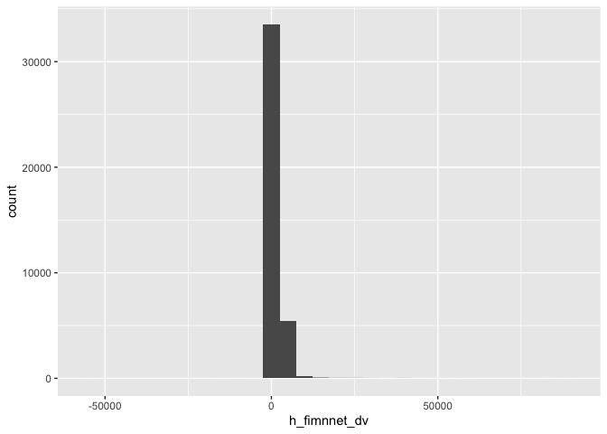<!-- -->
    
    ``` r
    summary(Data8$h_fimnnet_dv)
    ```
    
        ##     Min.  1st Qu.   Median     Mean  3rd Qu.     Max. 
        ## -53958.2    753.2   1300.0   1542.0   1972.8  89379.6
    
    ``` r
    ggplot(Data8,
       aes(x = h_fimnnet_dv)) +
      geom_histogram() +
      xlim(-100, 5000)
    ```
    
    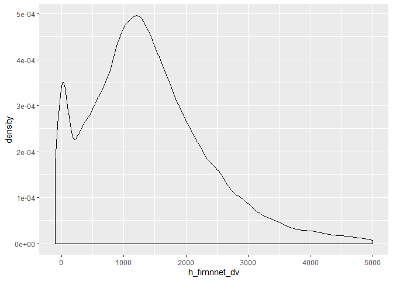<!-- -->
    
    ``` r
    ggplot(Data8,
       aes(x = h_fimnnet_dv)) +
      geom_histogram(binwidth = 1000) +
      xlim(-100, 5000)
    ```
    
    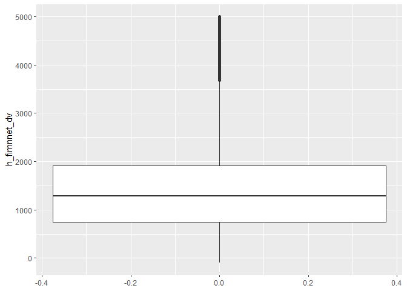<!-- -->
    
    ``` r
    ggplot(Data8,
       aes(x = h_fimnnet_dv)) +
      geom_histogram(binwidth = 1) +
      xlim(-100, 5000)
    ```
    
    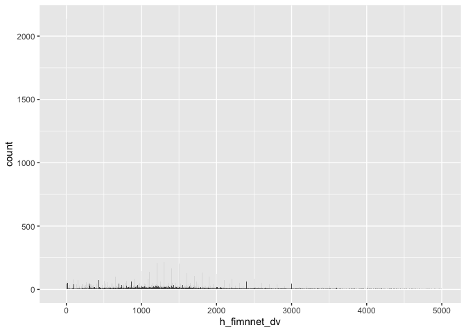<!-- -->
    
    ``` r
    ggplot(Data8,
       aes(x = h_fimnnet_dv)) +
      geom_histogram(binwidth = 100) +
      xlim(-100, 5000)
    ```
    
    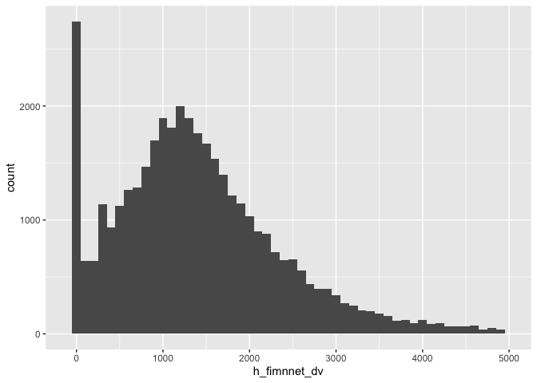<!-- -->
    
    ``` r
    ggplot(Data8,
       aes(x = h_fimnnet_dv)) +
      geom_histogram(binwidth = 100) +
      xlim(-100, 5000) +
      xlab("Net monthly personal income")
    ```
    
    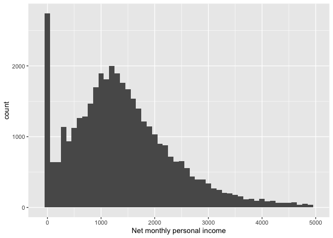<!-- -->
    
    ``` r
    ggplot(Data8,
       aes(x = h_fimnnet_dv)) +
      geom_density() +
      xlim(-100, 5000)
    ```
    
    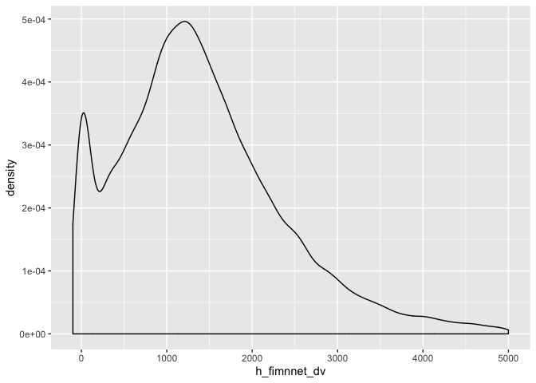<!-- -->
    
    ``` r
    ggplot(Data8,
       aes(y = h_fimnnet_dv)) +
      geom_boxplot() +
      ylim(-100,5000)
    ```
    
    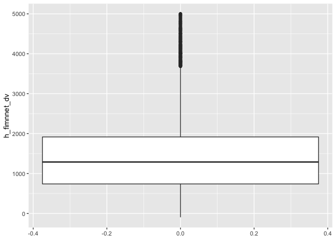<!-- -->

3.  Visualise the distribution of sex with a bar graph.
    
    ``` r
    Data8 %>%
      mutate(h_sex_dv = ifelse(h_sex_dv == 1, "male",
                           ifelse(h_sex_dv == 2, "female", NA))) %>%
      filter(!is.na(h_sex_dv)) %>%
      ggplot(
    aes(x = h_sex_dv)
      ) +
      geom_bar() +
      xlab("Sex")
    ```
    
    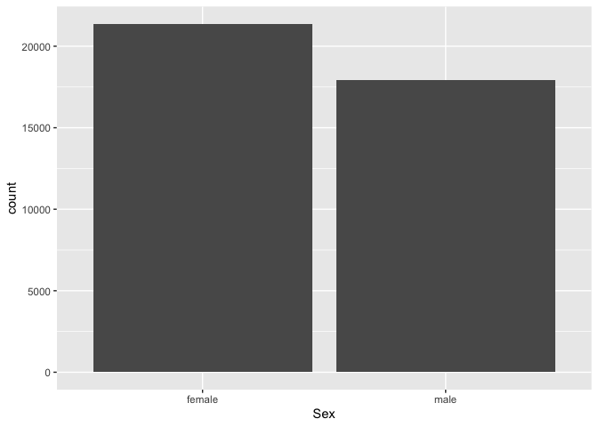<!-- -->
    
    ``` r
    # ggplot(Data8,
    #        aes(x = h_sex_dv)) +
    #   geom_bar()
    
    
    Data8 %>%
      mutate(h_sex_dv = ifelse(h_sex_dv == 1, "male",
                           ifelse(h_sex_dv == 2, "female", NA))) %>%
      filter(!is.na(h_sex_dv)) %>%
      ggplot(
    aes(x = h_sex_dv)
      ) +
      geom_bar(aes(y = (..count..)/sum(..count..) * 100)) +
      xlab("Sex") +
      ylab("Percent") +
      scale_y_continuous(breaks=seq(0, 60, 10))
    ```
    
    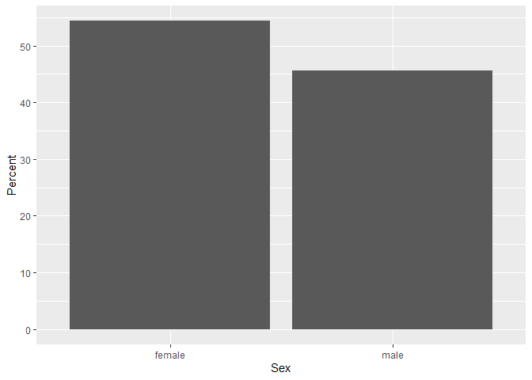<!-- -->
    
    ``` r
    Data8 %>%
      mutate(h_sex_dv = ifelse(h_sex_dv == 1, "male",
                           ifelse(h_sex_dv == 2, "female", NA))) %>%
      filter(!is.na(h_sex_dv)) %>%
      count(h_sex_dv) %>%
      mutate(perc = n / sum(n) * 100) %>%
      ggplot(aes(x = "", y = perc, fill = h_sex_dv)) +
    geom_bar(width = 1, stat = "identity") +
    coord_polar("y", start = 0)
    ```
    
    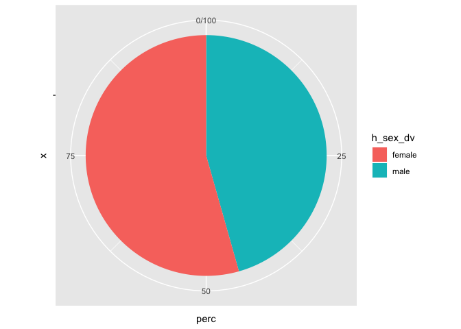<!-- -->
    
    ``` r
    Data8 %>%
      count(h_gor_dv) %>%
      mutate(perc = n / sum(n) * 100) %>%
      ggplot(aes(x = "", y = perc, fill = h_gor_dv)) +
    geom_bar(width = 1, stat = "identity") +
    coord_polar("y", start = 0)
    ```
    
    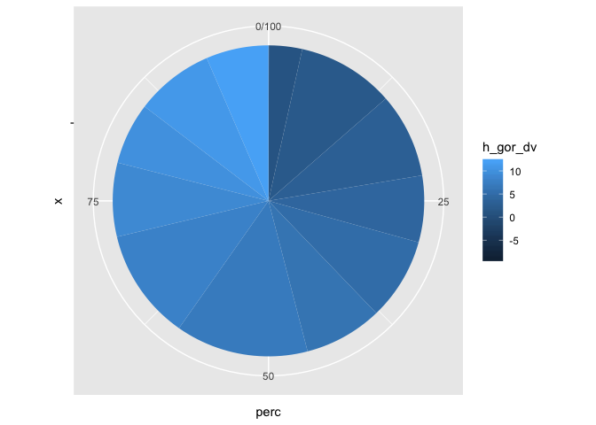<!-- -->
    
    ``` r
    Data8 %>%
      ggplot(aes(x = h_gor_dv)) +
    geom_bar()
    ```
    
    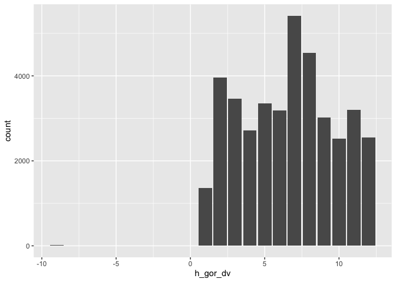<!-- -->

<!-- Bivariate distributions. -->

<!-- 4. Create a bar chart showing mean income by region. -->

<!--     ```{r} -->

<!-- Data8 <- Data8 %>% -->

<!--   mutate(region = recode(h_gor_dv, -->

<!--                          `-9` = NA_character_, -->

<!--                          `1` = "North East", -->

<!--                          `2` = "North West", -->

<!--                          `3` = "Yorkshire", -->

<!--                          `4` = "East Midlands", -->

<!--                          `5` = "West Midlands", -->

<!--                          `6` = "East of England", -->

<!--                          `7` = "London", -->

<!--                          `8` = "South East", -->

<!--                          `9` = "Souh West", -->

<!--                          `10` = "Wales", -->

<!--                          `11` = "Scotland", -->

<!--                          `12` = "Northern Ireland")) -->

<!-- byRegion <- Data8 %>% -->

<!--   filter(!is.na(region)) %>% -->

<!--   group_by(region) %>% -->

<!--   summarise( -->

<!--     medianIncome = median(h_fimnnet_dv, na.rm = TRUE) -->

<!--   ) -->

<!-- byRegion %>% -->

<!-- ggplot( -->

<!--   aes(x = reorder(region, medianIncome), y = medianIncome) -->

<!--   ) + -->

<!--   geom_bar(stat = "identity") + -->

<!--   xlab("") + -->

<!--   ylab("Median net monthly personal income") + -->

<!--   theme(axis.text.x = element_text(angle = 45, hjust = 1)) -->

<!--     ``` -->

<!-- 5. Make a dot plot showing the same information as above (without splitting by sex). Sort regions in the descending order by mean income. -->

<!--     ```{r} -->

<!-- byRegion %>% -->

<!-- ggplot( -->

<!--   aes(y = reorder(region, medianIncome), x = medianIncome) -->

<!--   ) + -->

<!--   geom_point(size = 3) + -->

<!--   xlab("Median net monthly personal income") + -->

<!--   ylab("") -->

<!--     ``` -->

<!-- 6. Make a line chart showing median income by age. -->

<!--     ```{r} -->

<!-- byAge <- Data8 %>% -->

<!--   group_by(h_age_dv) %>% -->

<!--   summarise( -->

<!--     medianIncome = median(h_fimnnet_dv, na.rm = TRUE) -->

<!--   ) -->

<!-- byAge %>% -->

<!--         ggplot(aes(x = h_age_dv, y = medianIncome)) + -->

<!--         geom_line() + -->

<!--         geom_smooth() + -->

<!--         xlim(21,80) + -->

<!--         xlab("Age") + -->

<!--         ylab("Median income") -->

<!-- # Split by sex -->

<!-- byAgeSex <- Data8 %>% -->

<!--   mutate(h_sex_dv = ifelse(h_sex_dv == 1, "male", -->

<!--                            ifelse(h_sex_dv == 2, "female", NA))) %>% -->

<!--   filter(!is.na(h_sex_dv)) %>% -->

<!--   group_by(h_age_dv, h_sex_dv) %>% -->

<!--   summarise( -->

<!--     medianIncome = median(h_fimnnet_dv, na.rm = TRUE) -->

<!--   ) -->

<!-- byAgeSex %>% -->

<!--         ggplot(aes(x = h_age_dv, y = medianIncome, colour = h_sex_dv)) + -->

<!--         geom_line() + -->

<!--         geom_smooth() + -->

<!--         xlim(21,80) + -->

<!--         ylim(0,2500) + -->

<!--         xlab("Age") + -->

<!--         ylab("Median income") -->

<!--     ``` -->
