Data Analysis 3: Week 7
================
Alexey Bessudnov
1 March 2019

Plan for today:

1.  Assignment 3: solution.
2.  Assignment 4.
3.  Homework for next week: functions.
4.  Exercises on data visualisation.

Exercises:

    ```r
    library(tidyverse)
    Data8 <- read_tsv("data/UKDA-6614-tab/tab/ukhls_w8/h_indresp.tab")
    Data8 <- Data8 %>%
      select(pidp, h_sex_dv, h_age_dv, h_gor_dv, h_fimnnet_dv)
    ```

Bivariate distributions.

1.  Create a bar chart showing mean income by region.
    
    ``` r
    Data8 <- Data8 %>%
      mutate(region = recode(h_gor_dv,
                         `-9` = NA_character_,
                         `1` = "North East",
                         `2` = "North West",
                         `3` = "Yorkshire",
                         `4` = "East Midlands",
                         `5` = "West Midlands",
                         `6` = "East of England",
                         `7` = "London",
                         `8` = "South East",
                         `9` = "Souh West",
                         `10` = "Wales",
                         `11` = "Scotland",
                         `12` = "Northern Ireland"))
    byRegion <- Data8 %>%
      filter(!is.na(region)) %>%
      group_by(region) %>%
      summarise(
    medianIncome = median(h_fimnnet_dv, na.rm = TRUE)
      )
    
    byRegion %>%
    ggplot(
      aes(x = reorder(region, medianIncome), y = medianIncome)
      ) +
      geom_bar(stat = "identity") +
      xlab("") +
      ylab("Median net monthly personal income") +
      theme(axis.text.x = element_text(angle = 45, hjust = 1))
    ```
    
    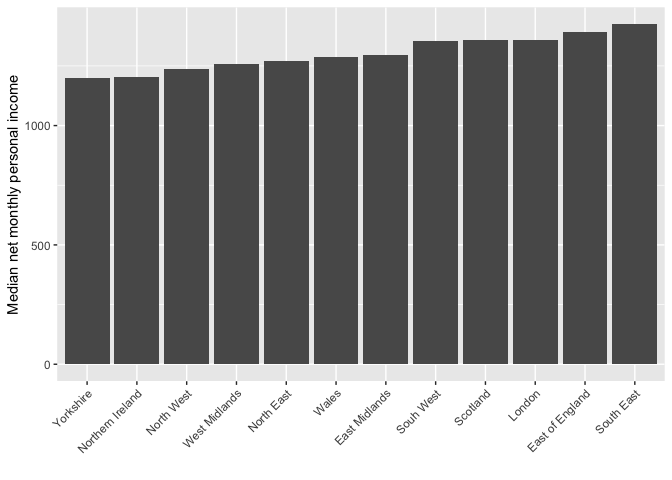<!-- -->
    
    ``` r
    byRegion %>%
    ggplot(
      aes(x = reorder(region, -medianIncome), y = medianIncome)
      ) +
      geom_bar(stat = "identity") +
      xlab("") +
      ylab("Median net monthly personal income") +
      theme(axis.text.x = element_text(angle = 90, hjust = 1))
    ```
    
    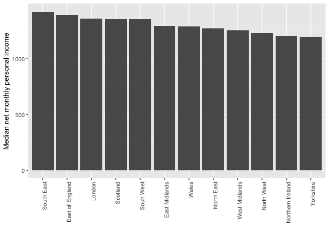<!-- -->

2.  Make a dot plot showing the same information as above (without
    splitting by sex). Sort regions in the descending order by mean
    income.
    
    ``` r
    byRegion %>%
    ggplot(
      aes(y = reorder(region, medianIncome), x = medianIncome)
      ) +
      geom_point(size = 3) +
      xlab("Median net monthly personal income") +
      ylab("")
    ```
    
    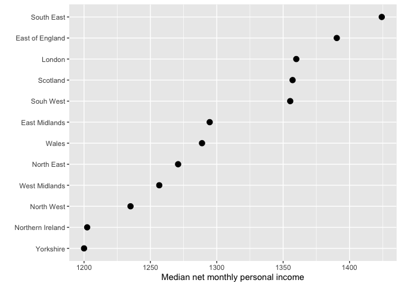<!-- -->

3.  Make a line chart showing median income by age.
    
    ``` r
    byAge <- Data8 %>%
      group_by(h_age_dv) %>%
      summarise(
    medianIncome = median(h_fimnnet_dv, na.rm = TRUE)
      )
    byAge
    ```
    
        ## # A tibble: 87 x 2
        ##    h_age_dv medianIncome
        ##       <dbl>        <dbl>
        ##  1       16          0  
        ##  2       17         16.0
        ##  3       18        229. 
        ##  4       19        436. 
        ##  5       20        534. 
        ##  6       21        667. 
        ##  7       22        922. 
        ##  8       23       1092. 
        ##  9       24       1165. 
        ## 10       25       1253. 
        ## # … with 77 more rows
    
    ``` r
    byAge %>%
        ggplot(aes(x = h_age_dv, y = medianIncome)) +
        geom_line() +
        geom_smooth() +
        xlim(21,80) +
        xlab("Age") +
        ylab("Median income")
    ```
    
    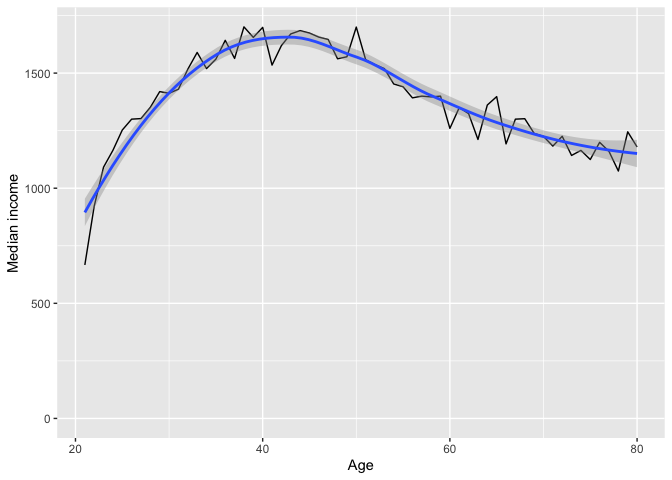<!-- -->

4.  Open the data from the youth questionnaire from wave 8. We will be
    working with the variable on BMI (h\_ypbmi\_dv) and visualise the
    distribution of BMI by sex, age, and ethnic group.

<!-- end list -->

``` r
youth8 <- read_tsv("data/UKDA-6614-tab/tab/ukhls_w8/h_youth.tab")

# summary(youth8$h_ypbmi_dv)
youth8 %>% pull(h_ypbmi_dv) %>% summary()
```

    ##    Min. 1st Qu.  Median    Mean 3rd Qu.    Max. 
    ##  -9.000  -9.000  -9.000  -2.477  -9.000  39.000

``` r
youth8 <- youth8 %>%
  mutate(bmi = recode(h_ypbmi_dv, `-9` = NA_real_))

youth8 %>% pull(bmi) %>% summary()
```

    ##    Min. 1st Qu.  Median    Mean 3rd Qu.    Max.    NA's 
    ##   10.40   17.20   19.10   19.81   21.80   39.00    2531

``` r
# simple histogram

youth8 %>%
  ggplot(aes(x = bmi)) +
  geom_histogram(bins = 50) +
  geom_vline(xintercept = 30, colour = "red") +
  xlab("Body mass index") +
  ylab("Number of observations")
```

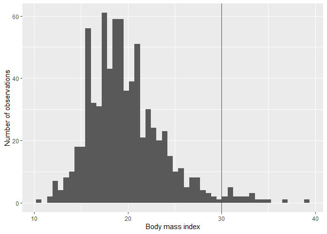<!-- -->

``` r
# BBC style

library(bbplot)
youth8 %>%
  ggplot(aes(x = bmi)) +
  geom_histogram(bins = 50) +
  geom_vline(xintercept = 30, colour = "red") +
  ylab("Number of observations") +
  bbc_style() +
  xlab("Body mass index")
```

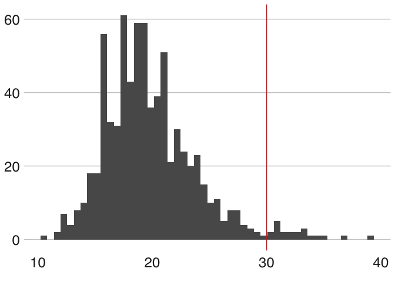<!-- -->

5.  BMI by sex.

Boxplot:

``` r
youth8 <- youth8 %>%
  mutate(sex = ifelse(h_sex_dv == 2, "female",
                      ifelse(h_sex_dv == 1, "male", NA)))
youth8 %>% count(h_sex_dv, sex)
```

    ## # A tibble: 2 x 3
    ##   h_sex_dv sex        n
    ##      <dbl> <chr>  <int>
    ## 1        1 male    1620
    ## 2        2 female  1652

``` r
youth8 %>%
  ggplot(aes(x = sex, y = bmi)) +
  geom_boxplot() +
  # this changes the boxplots from vertical to horizontal
  coord_flip()
```

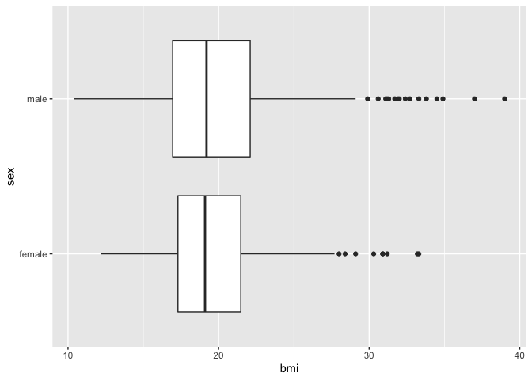<!-- -->

6.  Density by group.

<!-- end list -->

``` r
youth8 %>%
  ggplot(aes(x = bmi, fill = sex)) +
  geom_histogram(position = "dodge")
```

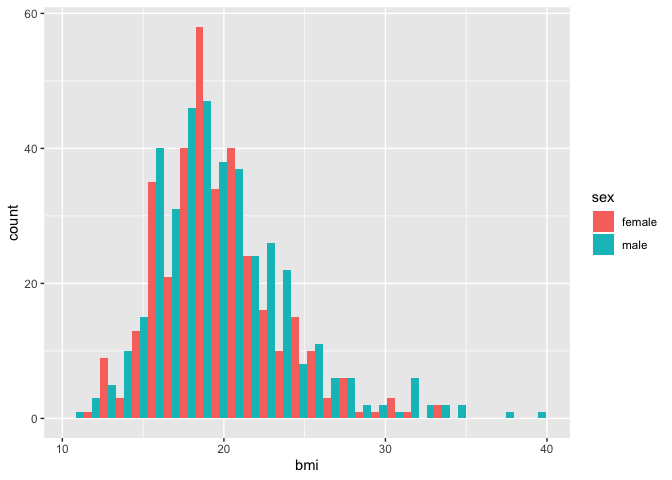<!-- -->

``` r
youth8 %>%
  ggplot(aes(x = bmi, fill = sex)) +
  geom_histogram(bins = 50, position = "identity", alpha = 0.5)
```

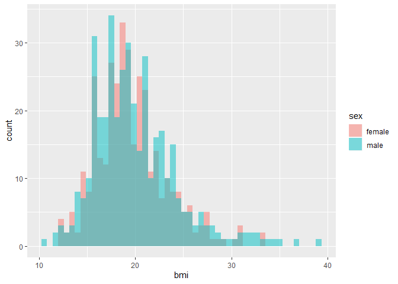<!-- -->

``` r
youth8 %>%
  ggplot(aes(x = bmi, colour = sex)) +
  geom_density()
```

<!-- -->

``` r
youth8 %>%
  ggplot(aes(x = bmi, fill = sex)) +
  geom_density()
```

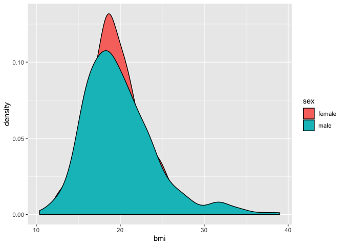<!-- -->

``` r
youth8 %>%
  ggplot(aes(x = bmi, fill = sex)) +
  geom_density() +
  # manually setting the colours
  scale_fill_manual(values = c("purple", "yellow"))
```

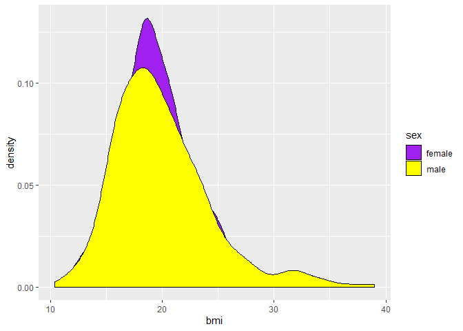<!-- -->

7.  Barplot with means.

<!-- end list -->

``` r
youth8 %>%
  group_by(sex) %>%
  summarise(
    meanBMI = mean(bmi, na.rm = TRUE)
  ) %>%
  ggplot(aes(x = sex, y = meanBMI, fill = sex)) +
  geom_bar(stat = "identity")
```

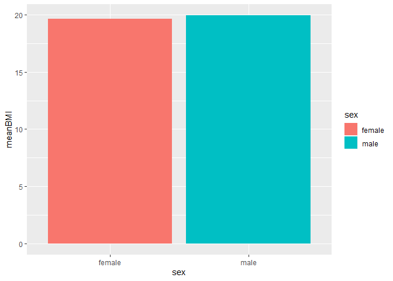<!-- -->

``` r
youth8 %>%
  group_by(sex) %>%
  summarise(
    meanBMI = mean(bmi, na.rm = TRUE)
  ) %>%
  ggplot(aes(x = sex, y = meanBMI)) +
  geom_point() +
  ylim(0, 25) +
  coord_flip()
```

<!-- -->

``` r
youth8 %>%
  group_by(h_gor_dv) %>%
  summarise(
    meanBMI = mean(bmi, na.rm = TRUE)
  ) %>%
  ggplot(aes(x = reorder(as.factor(h_gor_dv), meanBMI), y = meanBMI)) +
  geom_point() +
  coord_flip()
```

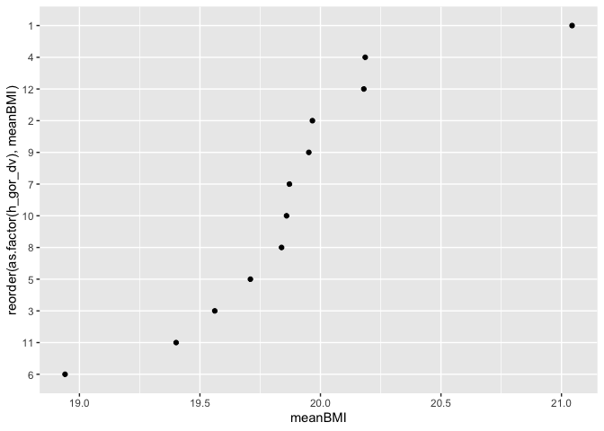<!-- -->

8.  Faceted chart.

<!-- end list -->

``` r
youth8 %>%
  ggplot(aes(x = bmi)) +
  geom_histogram(bins = 50) +
  geom_vline(xintercept = 30, colour = "red") +
  xlab("Body mass index") +
  ylab("Number of observations") +
  facet_wrap(~ sex)
```

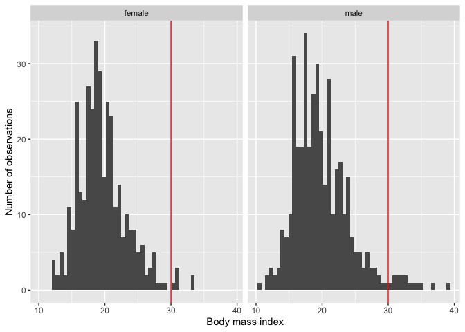<!-- -->
