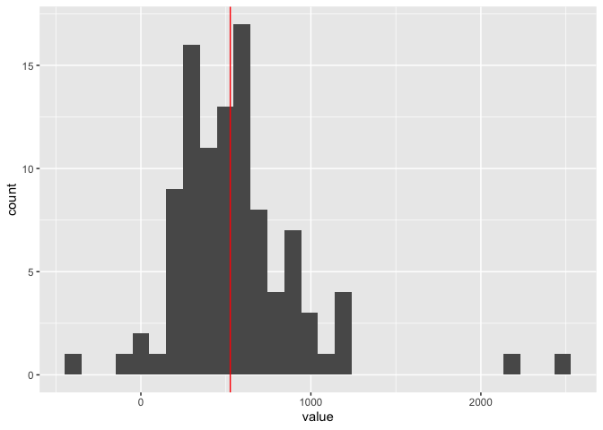

Data Analysis 3: Week 9
================
Alexey Bessudnov
11 March 2020

Plan for today:

1.  Assignment 4: solutions.
2.  Assignment 5.
3.  Exercises on conditional statements and iteration.

Exercises.

1.  Check if a number is even. If it is print “Even”. If it isn’t print
    “Odd”. If it’s 0 print “Zero”.
    
    ``` r
    x <- 2
    
    if (x == 0) {
      print("Zero")
    } else {
    if (x %% 2 == 0) {
      print("Even")
    } else {
        print("Odd")
    }
      }
    ```
    
        ## [1] "Even"

2.  Write a for loop finding the largest element of a numeric vector and
    print it on the screen.
    
    ``` r
    x <- c(3, 5, 8, -2)
    max(x)
    ```
    
        ## [1] 8
    
    ``` r
    for (i in 1:3) {
      print(i)
    }
    ```
    
        ## [1] 1
        ## [1] 2
        ## [1] 3
    
    ``` r
    for(i in 1:length(x)) {
      print(x[i])
    }
    ```
    
        ## [1] 3
        ## [1] 5
        ## [1] 8
        ## [1] -2
    
    ``` r
    max_x <- x[1]
    for (i in 2:length(x)) {
      if (x[i] > max_x) {max_x <- x[i]}
    }
    max_x
    ```
    
        ## [1] 8

3.  Write a for loop finding the largest element of a numeric matrix and
    print it on the screen.
    
    ``` r
    x <- matrix(c(1, -3, 7, 4, 10, 7, -5, 0), nrow = 4)
    x
    ```
    
        ##      [,1] [,2]
        ## [1,]    1   10
        ## [2,]   -3    7
        ## [3,]    7   -5
        ## [4,]    4    0
    
    ``` r
    max_x <- 0
    for (i in 1:dim(x)[1]) {
      for (j in 1:dim(x)[2]) {
      if (x[i,j] > max_x) {max_x <- x[i,j]}
      }
    }
    max_x
    ```
    
        ## [1] 10

4.  Write a while loop finding the largest element of a numeric vector
    and print it on the screen.
    
    ``` r
    i <- 1 
    while (i < 10) {
      print(i)
      i <- i + 1
    }
    ```
    
        ## [1] 1
        ## [1] 2
        ## [1] 3
        ## [1] 4
        ## [1] 5
        ## [1] 6
        ## [1] 7
        ## [1] 8
        ## [1] 9
    
    ``` r
    x <- c(3, 5, 8, -2)
    
    max_x <- x[1]
    i <- 2
    while (i <= length(x)) {
    if (x[i] > max_x) {max_x <- x[i]}
      i <- i + 1
    }
    max_x
    ```
    
        ## [1] 8

5.  x is a vector with whole numbers (zero and positive integers). If
    the largest even element of x is smaller than the largest odd
    element of x, all even elements of x are replaced by 0s. Otherwise
    all odd elements of x are replaced by 0s. For example, if x = {7; 1;
    3; 2; 14; 5; 9; 6} the output should be \[0; 0; 0; 2; 14; 0; 0; 6\].
    
    ``` r
    x <- c(7, 1, 3, 2, 14, 5, 9, 6)
    max <- 0
    for (i in seq_along(x)) {
                if (x[i] > max) {max <- x[i]}
    }
    for (i in seq_along(x)) {
        if (max %% 2 == 0) {
                if (x[i] %% 2 != 0) {x[i] <- 0}
        }
        else {
                if (x[i] %% 2 == 0) {x[i] <- 0}
        }
    }
    x
    ```
    
        ## [1]  0  0  0  2 14  0  0  6

6.  x is a vector with whole numbers. Write a programme that counts the
    number of pairs of the elements of x where the sum can be divided by
    12 without a remainder.

For example, for x = {8; 10; 14; 7; 13; 5; 30; 9; 6} then the answer is
3 ((10, 14); (7, 5); (30, 6)).

    ```r
    x <- c(8, 10, 14, 7, 13, 5, 30, 9, 6)
    k <- 0
    for (i in 1:(length(x)-1)) {
        for (j in (i+1):length(x)) {
                if ((x[i] + x[j]) %% 12 == 0) {
                         k <- k + 1
                         print(c(x[i], x[j]))
                }
        }
    }
    ```
    
    ```
    ## [1] 10 14
    ## [1] 7 5
    ## [1] 30  6
    ```
    
    ```r
    k
    ```
    
    ```
    ## [1] 3
    ```

7.  Write a function to calculate the factorial (i.e. 5\! = 1x2x3x4x5).
    Note that 0\! = 1, and for the negative numbers the factorial is not
    defined. (Hint: use recursion.)

<!-- end list -->

``` r
myFactorial <- function(x){
  if (x == 0) {return(1)}
  x * myFactorial(x-1)
}
myFactorial(4)
```

    ## [1] 24

8.  Use this function to calculate the factorial for the numbers from 1
    to 10. (Hint: use map()).

<!-- end list -->

``` r
# this is not going to work because the function has not been vectorised
myFactorial(1:10)
```

    ##  [1]  1  2  3  4  5  6  7  8  9 10

``` r
# a for() loop
output <- numeric(10)
for (i in 1:10) {
  output[i] <- myFactorial(i)
}
output
```

    ##  [1]       1       2       6      24     120     720    5040   40320  362880
    ## [10] 3628800

``` r
# with map()
library(tidyverse)

mapply(myFactorial, 1:10)
```

    ##  [1]       1       2       6      24     120     720    5040   40320  362880
    ## [10] 3628800

``` r
map_dbl(1:10, myFactorial)
```

    ##  [1]       1       2       6      24     120     720    5040   40320  362880
    ## [10] 3628800

9.  Open the indresp file for wave 8 and keep two variables: sex
    (h\_sex\_dv) and total net personal income (h\_fimnnet\_dv). You may
    need to clean sex and retain only values for male and female. Keep
    only cases with non-missing values for sex and income.

<!-- end list -->

1)  regress income on sex (i.e. find the difference between mean income
    for men and women). Store the estimate for the regression
    coefficient.
2)  Now regress income on sex 100 times, each time with a random sample
    of 1,000 people. Store 100 regression coefficients in a vector and
    illustrate their distribution graphically.
3)  Now do the same, changing the sample size to 100 people, and compare
    two distributions.

<!-- end list -->

``` r
df <- read_tsv("data/UKDA-6614-tab/tab/ukhls_w8/h_indresp.tab") %>%
        select(h_sex_dv, h_fimnnet_dv)
df <- df %>%
        mutate(h_sex_dv = ifelse(h_sex_dv == 1, "male",
                      ifelse(h_sex_dv == 2, "female", NA))) %>%
        filter(!is.na(h_sex_dv)) %>%
        filter(!is.na(h_fimnnet_dv))
est <- lm(h_fimnnet_dv ~ h_sex_dv, df)$coefficients[[2]]

output <- numeric(100)
for (i in 1:100) {
  df1 <- df %>% sample_n(1000)
  output[i] <- lm(h_fimnnet_dv ~ h_sex_dv, df1)$coefficients[[2]]
}
output
```

    ##   [1] 442.2780 441.5468 493.6974 490.3241 392.1250 409.5501 538.0345 587.9408
    ##   [9] 584.9505 654.6129 767.5041 481.8731 563.4332 439.7706 435.7161 499.2807
    ##  [17] 428.9544 514.3953 572.7683 421.9532 666.0668 497.3714 382.3908 468.0126
    ##  [25] 403.5888 614.7623 569.3252 551.5288 468.5403 619.0273 551.9777 743.4494
    ##  [33] 541.7151 635.5397 654.0896 592.5768 710.7068 587.1619 462.2322 462.7153
    ##  [41] 412.4270 651.0086 456.4835 421.9411 574.9838 656.0249 487.4217 415.8094
    ##  [49] 475.5250 565.0301 612.9608 539.7866 654.1028 512.5845 354.7173 427.0190
    ##  [57] 500.4909 517.4631 567.1301 499.5162 515.5959 311.8080 533.4592 498.4404
    ##  [65] 393.0400 601.4381 469.0480 351.7578 510.9326 739.9835 684.9946 336.2549
    ##  [73] 727.5177 375.8017 516.9276 434.0070 608.3617 570.4080 547.7792 612.1026
    ##  [81] 660.0399 669.4700 661.9076 753.7802 489.7696 586.5897 564.4461 440.3855
    ##  [89] 585.3100 630.3012 461.3096 381.1875 277.8615 511.4777 407.0958 633.9636
    ##  [97] 581.7586 472.2356 538.1080 345.2104

``` r
sexCoef <- map(1:100, ~ df %>% sample_n(100)) %>%
        map_dbl(~ lm(h_fimnnet_dv ~ h_sex_dv, data = .)$coefficients[2])

enframe(sexCoef) %>%
        ggplot(aes(x = value)) +
        geom_histogram() +
        geom_vline(xintercept = est, colour = "red")
```

<!-- -->
