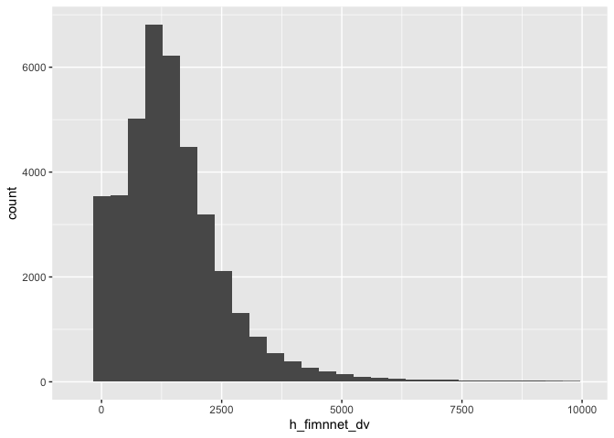
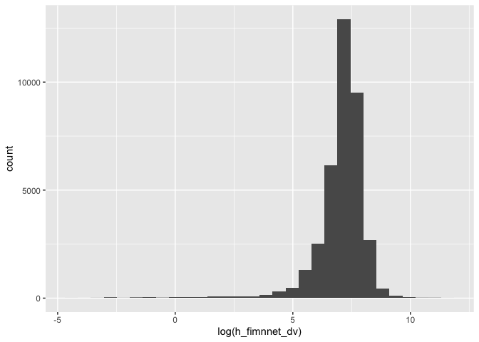
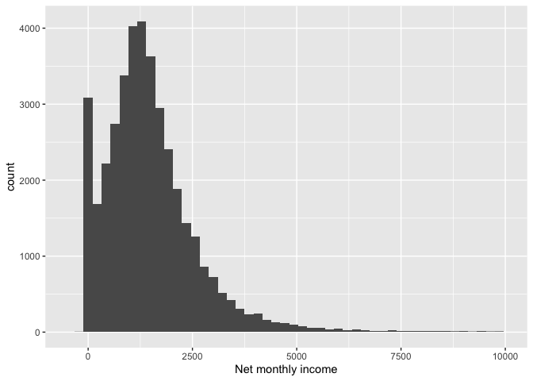
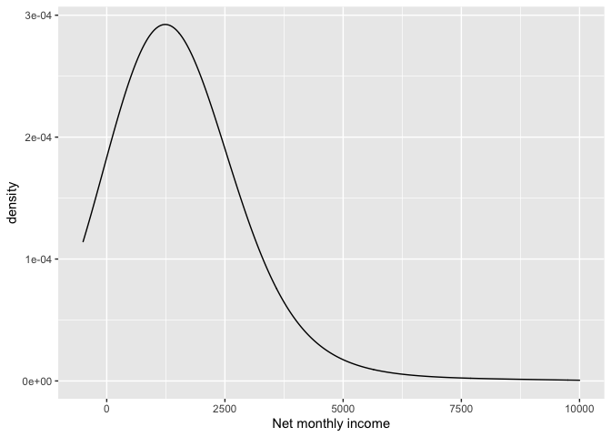
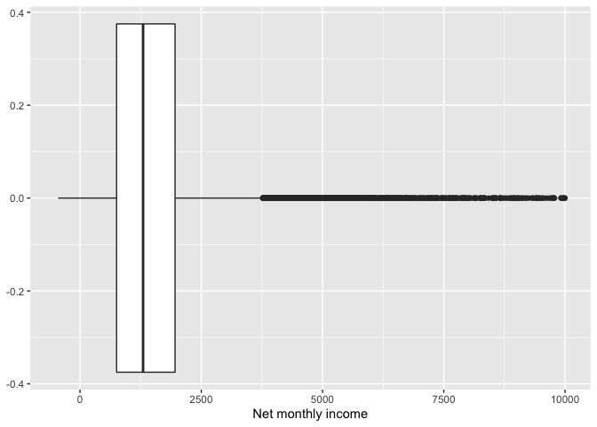
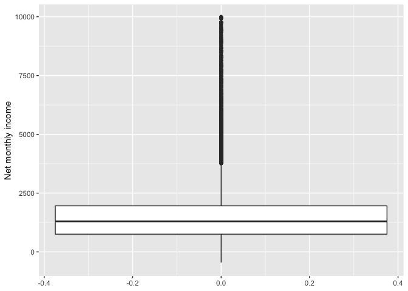
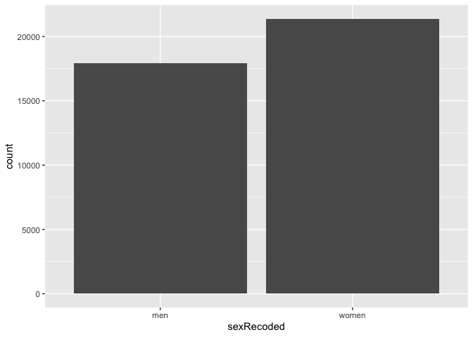
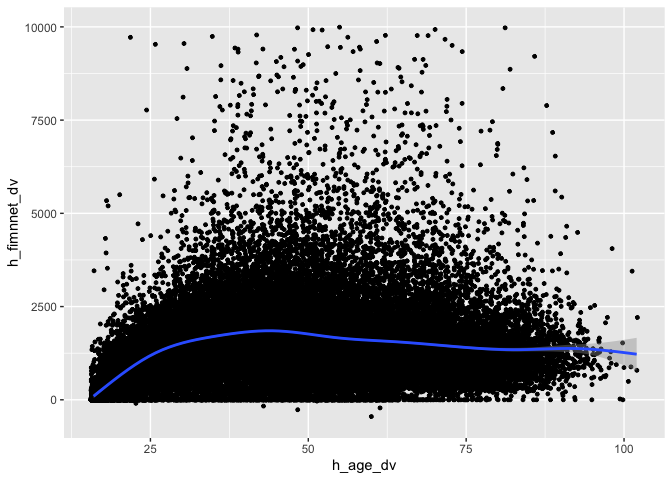
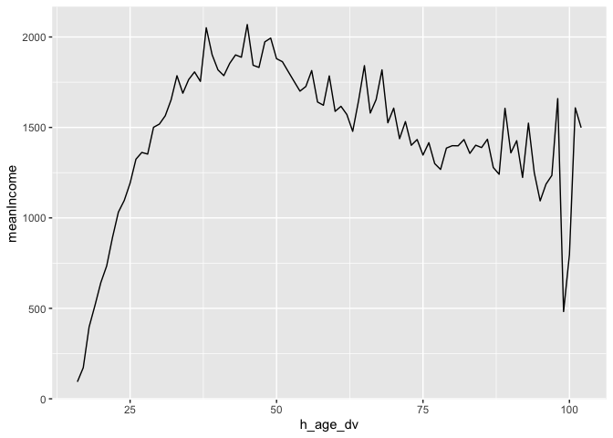

Data Analysis in Social Science (22 February)
================

``` r
library(tidyverse)
```

    ## ── Attaching packages ─────────────────────────────────────── tidyverse 1.3.0 ──

    ## ✓ ggplot2 3.3.3     ✓ purrr   0.3.4
    ## ✓ tibble  3.0.4     ✓ dplyr   1.0.2
    ## ✓ tidyr   1.1.2     ✓ stringr 1.4.0
    ## ✓ readr   1.4.0     ✓ forcats 0.5.0

    ## ── Conflicts ────────────────────────────────────────── tidyverse_conflicts() ──
    ## x dplyr::filter() masks stats::filter()
    ## x dplyr::lag()    masks stats::lag()

``` r
library(vroom)
```

Exercises.

1)  Read the indresp file from Wave 8 and keep the following variables:
    pidp, derived sex and age (h\_sex\_dv and h\_age\_dv), and net
    personal income (h\_fimnnet\_dv).

2)  Visualise the distribution of income with a histogram, a density
    plot and a box plot.

3)  Visualise the distribution of sex with a bar chart.
    
    ``` r
    W8 <- vroom("UKDA-6614-tab/tab/ukhls_w8/h_indresp.tab",
            col_select = c(pidp, h_sex_dv, h_age_dv, h_fimnnet_dv))
    ```
    
        ## Rows: 39,293
        ## Columns: 4
        ## Delimiter: "\t"
        ## dbl [4]: pidp, h_sex_dv, h_age_dv, h_fimnnet_dv
        ## 
        ## Use `spec()` to retrieve the guessed column specification
        ## Pass a specification to the `col_types` argument to quiet this message
    
    ``` r
    # histogram
    
    W8 %>%  
      ggplot(aes(x = h_fimnnet_dv)) +
      geom_histogram() +
      xlim(-500, 10000)
    ```
    
        ## `stat_bin()` using `bins = 30`. Pick better value with `binwidth`.
    
        ## Warning: Removed 141 rows containing non-finite values (stat_bin).
    
        ## Warning: Removed 2 rows containing missing values (geom_bar).
    
    <!-- -->
    
    ``` r
    W8 %>%  
      ggplot(aes(x = log(h_fimnnet_dv))) +
      geom_histogram()
    ```
    
        ## Warning in log(h_fimnnet_dv): NaNs produced
    
        ## Warning in log(h_fimnnet_dv): NaNs produced
    
        ## `stat_bin()` using `bins = 30`. Pick better value with `binwidth`.
    
        ## Warning: Removed 2052 rows containing non-finite values (stat_bin).
    
    <!-- -->
    
    ``` r
    W8 %>%  
      ggplot(aes(x = h_fimnnet_dv)) +
      geom_histogram(bins = 50) +
      xlim(-500, 10000) +
      xlab("Net monthly income")
    ```
    
        ## Warning: Removed 141 rows containing non-finite values (stat_bin).
    
        ## Warning: Removed 2 rows containing missing values (geom_bar).
    
    <!-- -->
    
    ``` r
      # Density curve
    
    W8 %>%  
      ggplot(aes(x = h_fimnnet_dv)) +
      geom_density(bw = 1000) +
      xlim(-500, 10000) +
      xlab("Net monthly income")
    ```
    
        ## Warning: Removed 141 rows containing non-finite values (stat_density).
    
    <!-- -->
    
    ``` r
    # Box plot
    
    W8 %>%  
      ggplot(aes(x = h_fimnnet_dv)) +
      geom_boxplot() +
      xlim(-500, 10000) +
      xlab("Net monthly income")
    ```
    
        ## Warning: Removed 141 rows containing non-finite values (stat_boxplot).
    
    <!-- -->
    
    ``` r
    W8 %>%  
      ggplot(aes(y = h_fimnnet_dv)) +
      geom_boxplot() +
      ylim(-500, 10000) +
      ylab("Net monthly income")
    ```
    
        ## Warning: Removed 141 rows containing non-finite values (stat_boxplot).
    
    <!-- -->
    
    ``` r
    # Bar chart: sex
    
    W8 %>%
      mutate(sexRecoded = ifelse(h_sex_dv == 1, "men",
                             ifelse(h_sex_dv == 2, "women", NA))) %>%
      filter(!is.na(sexRecoded)) %>%
      ggplot(aes(x = sexRecoded)) +
      geom_bar()
    ```
    
    <!-- -->
    
    ``` r
    # Scatter plot: age vs income
    
    W8 %>%
      ggplot(aes(x = h_age_dv, y = h_fimnnet_dv)) +
      geom_point(size = 1, position = "jitter") +
      geom_smooth() +
      ylim(-500, 10000)
    ```
    
        ## `geom_smooth()` using method = 'gam' and formula 'y ~ s(x, bs = "cs")'
    
        ## Warning: Removed 141 rows containing non-finite values (stat_smooth).
    
        ## Warning: Removed 142 rows containing missing values (geom_point).
    
    <!-- -->
    
    ``` r
    # Line chart: age vs. mean income
    
    W8 %>%
      group_by(h_age_dv) %>%
      summarise(
    meanIncome = mean(h_fimnnet_dv, na.rm = TRUE)
      ) %>%
      ggplot(aes(x = h_age_dv, y = meanIncome)) +
    geom_line()
    ```
    
        ## `summarise()` ungrouping output (override with `.groups` argument)
    
    <!-- -->
